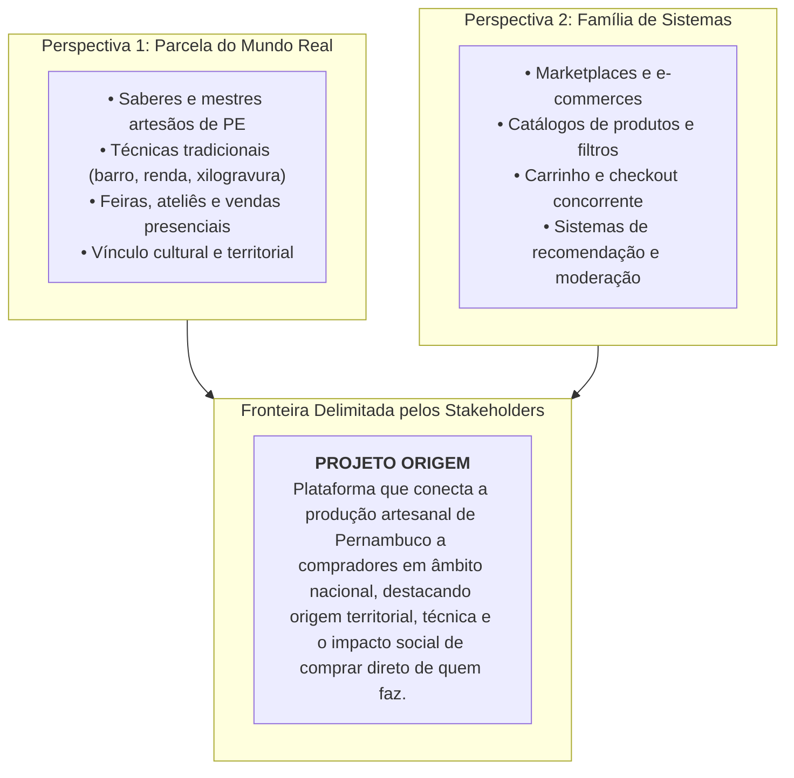
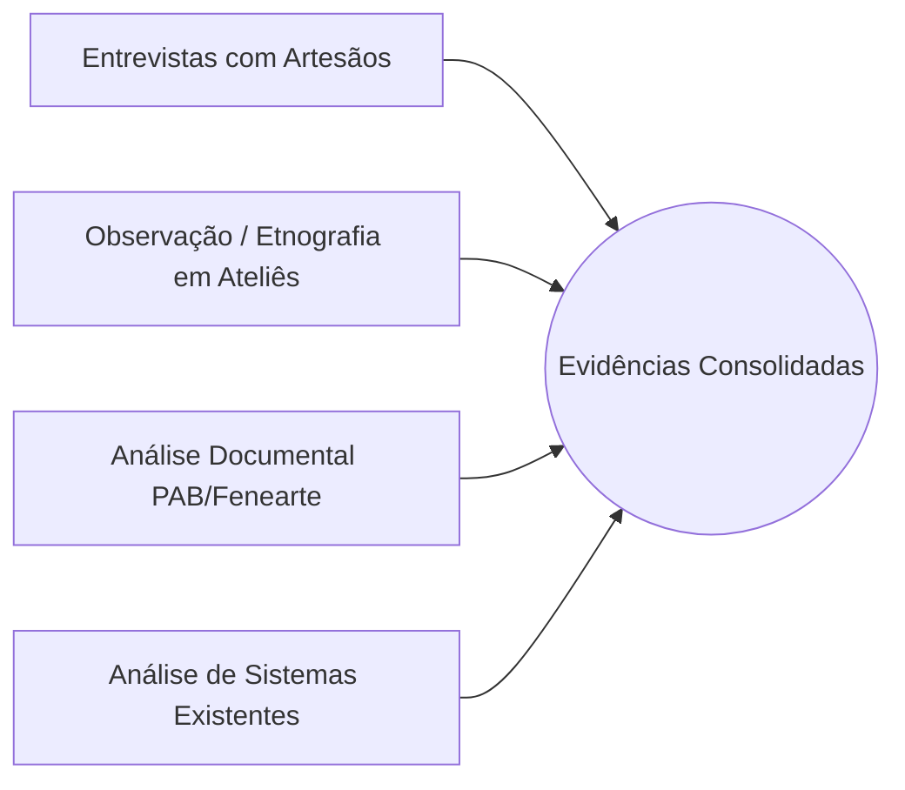

# 🏛️ 01. Análise de Domínio

### Projeto Integrador IV · Marketplace Origem
**Disciplina:** Requisitos, Projeto de Software e Validação (ADS020) · **Semestre:** 2026.2  
**Referência Metodológica:** Czarnecki & Eisenecker, Pressman, Zattar et al.

---

## 1. O que é o Domínio do Origem?

Na Engenharia de Software, o **domínio** é uma área de conhecimento delimitada em função dos requisitos dos *stakeholders*, que reúne os conceitos e a terminologia dos praticantes daquela área e o conhecimento de como construir sistemas nela (*Czarnecki & Eisenecker*).

Essa abordagem integra duas perspectivas complementares:

---

## 2. As 4 Informações-Alvo do Domínio

A análise do domínio organiza o conhecimento a partir de quatro aspectos fundamentais, servindo como alvos para orientar a investigação:

> [!IMPORTANT]
> **Regra de Engenharia de Requisitos:** Ao registrar *Oportunidades de melhoria*, descreve-se o **problema, a dificuldade ou a dor real do participante**, e nunca a solução digital imaginada. *(Exemplo: "O artesão não sabe se ainda tem a peça quando recebe uma mensagem de compra" é problema; "Falta um cadastro de estoque" é solução).*

| Aspecto | Definição | Mapeamento no Projeto Origem |
| :--- | :--- | :--- |
| **Atores** | Pessoas, organizações ou sistemas que participam do domínio ou são afetados por ele. | • **Artesão / Mestre:** Produtor criativo individual ou membro de cooperativa. • **Comprador:** Consumidor interessado em arte, decoração e identidade cultural. • **Administrador / Curador:** Responsável pela governança e moderação cultural. • **Serviço de Pagamento:** Sistema externo de processamento de checkout simulado. |
| **Processos** | Atividades realizadas pelos atores para atingir seus objetivos de negócio. | • Produção manual da peça a partir de matérias-primas locais. • Registro fotográfico e precificação da peça no ateliê. • Divulgação e atendimento a compradores. • Embalagem e despacho com proteção física especial. • Controle físico e baixa de estoque de peças únicas. • Participação em feiras culturais e exposições. |
| **Restrições** | Regras, limitações ou condições do mundo real que governam o domínio. | • **Peça única ou tiragem estrita:** Sem reposição industrial imediata. • **Tempo de produção:** Peças sob encomenda exigem semanas de trabalho manual. • **Logística e frete:** Fragilidade dos materiais (ex: cerâmica) e custo logístico interestadual. • **Conectividade:** Artesãos em polos rurais/interiores têm acesso intermitente à internet. |
| **Oportunidades de Melhoria (Dores Reais)** | Ineficiências, conflitos ou gargalos a serem solucionados. | • **Conflito de venda simultânea:** A mesma peça artesanal única é vendida presencialmente ou por mensagem enquanto outro cliente tenta adquiri-la. • **Invisibilidade cultural:** Compradores não conseguem diferenciar peças genuínas de réplicas industriais por falta de histórico e autoria. • **Descentralização de pedidos:** Falta de rastreabilidade de pagamentos e dados de entrega dispersos em redes sociais. • **Dependência de intermediários:** Margem de lucro do artesão reduzida por múltiplos atravessadores. |

---

## 3. Linguagem Ubíqua (Glossário do Domínio)

Para evitar ambiguidades entre quem desenvolve, quem testa e quem atua no negócio, adota-se os seguintes termos padronizados:

* **Artesão / Mestre:** Sujeito criador que detém o saber tradicional e comercializa suas obras.
* **Obra / Peça Artesanal:** Item físico produzido manualmente, de caráter exclusivo ou tiragem limitada.
* **Técnica / Tipologia:** Saber tradicional aplicado na confecção (ex: *Cerâmica Figurativa de Caruaru, Renda Renascença de Poção/Pesqueira, Xilogravura de Bezerros, Tapeçaria de Timbaúba*).
* **Polo / Região de Origem:** Território cultural de Pernambuco de onde emana a produção (ex: *Agreste Central, Zona da Mata, Sertão do Pajeú, Vale do São Francisco, RMR*).
* **Vitrine Cultural:** Catálogo público digital com ênfase na narrativa do autor (*storytelling*).
* **Ateliê:** Espaço de trabalho e gestão do catálogo de um artesão.
* **Checkout Concorrente:** Fluxo de garantia de integridade transacional na reserva e baixa de estoque de itens com estoque unitário restrito.

---

## 4. Técnicas de Obtenção de Evidências

Uma análise sólida não se baseia em opiniões prévias da equipe, mas em **evidências trianguladas**:

1. **Entrevista Semiestruturada:** Conversas com artesãos para compreender termos próprios, gargalos no atendimento e processos reais de embalagem e frete.
2. **Observação e Etnografia:** Acompanhamento presencial ou contextual do cotidiano de ateliês, identificando que muitos artesãos usam cadernos físicos e anotações paralelas para controlar suas vendas.
3. **Análise Documental:** Consulta às normas do *Programa do Artesanato Brasileiro (PAB)*, regulamentos de feiras estaduais e especificações de patrimônio imaterial de Pernambuco.
4. **Análise de Sistemas Existentes:** Estudo de plataformas de mercado (Elo7, Etsy, Mercado Livre), identificando que nenhuma delas oferece campos nativos para valorização da técnica regional ou histórico do mestre artesão.
