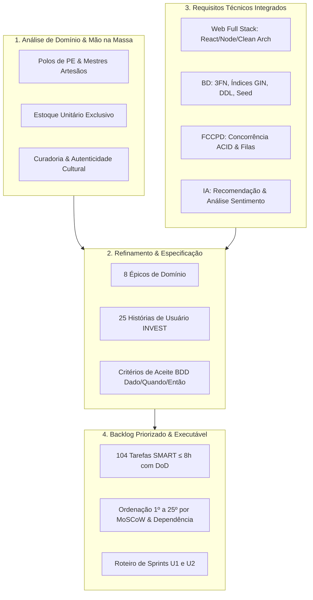

# 📜 Documento de Submissão: Backlog Priorizado Consolidado

### Projeto Integrador IV · Marketplace Origem
**Disciplina Principal:** Requisitos, Projeto de Software e Validação (ADS020) · **Semestre:** 2026.2  
**Disciplinas Integradas:** Desenvolvimento Web Full Stack · Banco de Dados · Fundamentos de Computação Concorrente, Paralela e Distribuída (FCCPD) · Inteligência Artificial  
**Referência Metodológica:** INVEST (Bill Wake), BDD / Gherkin (Gojko Adzic / Dan North), SMART Tasks (Doran), MoSCoW (DSDM Framework), Clean Architecture (Robert C. Martin).

---

## 1. Visão Geral da Atividade e Consolidação de Domínio

Este documento consolida o **Backlog Priorizado Oficial** do sistema **Marketplace Origem**, integrando:
1. Os aprendizados da **Atividade Mão na Massa** e da **Análise de Domínio** sobre o artesanato tradicional de Pernambuco (polos culturais como Alto do Moura, Tracunhaém, Bezerros, Goiana; atores: Visitante, Comprador, Artesão/Mestre e Administrador Curador; peças exclusivas de estoque unitário e preservação cultural);
2. Os refinamentos obtidos durante o **Workshop de Refinamento** (escrita de Histórias de Usuário INVEST e especificação por exemplos em BDD / Gherkin);
3. As diretrizes e restrições técnicas das disciplinas integradas (Clean Architecture, API RESTful, UI Responsiva acessível WCAG AA, concorrência transacional com `SELECT FOR UPDATE` contra *overselling*, filas assíncronas RabbitMQ/BullMQ, banco relacional normalizado até 3FN com índices GIN/B-Tree e modelos de recomendação/NLP).



---

## 2. Metodologia de Priorização e Cronograma de Sprints

O backlog foi ordenado considerando a combinação de 4 dimensões metodológicas:
* **Precedência Lógica e Dependência:** Componentes de infraestrutura, identidade e banco de dados fundamentam os fluxos de vitrine e catálogo; catálogo aprovado fundamenta o carrinho; carrinho fundamenta o checkout concorrente.
* **MoSCoW:** Separação estrita entre o núcleo indispensável (*Must Have* da Unidade 1), enriquecimentos operacionais (*Should Have*) e diferenciais analíticos/IA (*Could Have* da Unidade 2).
* **Matriz Valor × Risco (Spikes FCCPD):** Antecipação do módulo crítico de concorrência transacional (*Checkout com Lock Pessimista - HU-14*) como Spike técnico prioritário.
* **Critérios INVEST:** Cada história de usuário é Independente, Negociável, Valiosa, Estimável, Pequena e Testável.

### 🗺️ Matriz Geral do Backlog Ordenado para Desenvolvimento

| Ordem | ID | Épico | História de Usuário | MoSCoW | Sprint Planejada | Esforço (Tarefas SMART) |
| :---: | :--- | :--- | :--- | :---: | :---: | :---: |
| **1º** | **HU-01** | Épico 1: Identidade e Acesso | Cadastro de Conta com Seleção de Perfil | **Must Have** | Sprint 1 (U1) | 8 tarefas · 32h |
| **2º** | **HU-02** | Épico 1: Identidade e Acesso | Autenticação Segura (JWT / RBAC) | **Must Have** | Sprint 1 (U1) | 3 tarefas · 18h |
| **3º** | **HU-09** | Épico 3: Gestão do Ateliê | Publicação de Nova Peça Artesanal | **Must Have** | Sprint 1 (U1) | 8 tarefas · 33h |
| **4º** | **HU-20** | Épico 7: Administração | Moderação de Publicações de Peças | **Must Have** | Sprint 1 (U1) | 3 tarefas · 18h |
| **5º** | **HU-05** | Épico 2: Descoberta e Vitrine | Busca Textual no Catálogo | **Must Have** | Sprint 2 (U1) | 4 tarefas · 22h |
| **6º** | **HU-06** | Épico 2: Descoberta e Vitrine | Filtro por Região de Origem (PE) | **Must Have** | Sprint 2 (U1) | 9 tarefas · 48h |
| **7º** | **HU-07** | Épico 2: Descoberta e Vitrine | Filtro por Técnica Artesanal | **Should Have** | Sprint 2 (U1) | 3 tarefas · 14h |
| **8º** | **HU-08** | Épico 2: Descoberta e Vitrine | Detalhes da Peça e Storytelling Cultural | **Should Have** | Sprint 2 (U1) | 3 tarefas · 18h |
| **9º** | **HU-11** | Épico 3: Gestão do Ateliê | Gestão de Estoque do Ateliê | **Must Have** | Sprint 3 (U1) | 4 tarefas · 16h |
| **10º** | **HU-13** | Épico 4: Carrinho e Checkout | Gestão do Carrinho de Compras | **Must Have** | Sprint 3 (U1) | 4 tarefas · 19h |
| **11º** | **HU-14** | Épico 4: Carrinho e Checkout | Checkout com Baixa Atômica Concorrente | **Must Have** | Sprint 3 (U1 / Spike) | 5 tarefas · 30h |
| **12º** | **HU-15** | Épico 5: Ciclo do Pedido | Acompanhamento de Pedido pelo Comprador | **Should Have** | Sprint 4 (U1/U2) | 3 tarefas · 20h |
| **13º** | **HU-17** | Épico 5: Ciclo do Pedido | Atualização de Status de Envio pelo Artesão | **Should Have** | Sprint 4 (U1/U2) | 3 tarefas · 16h |
| **14º** | **HU-12** | Épico 3: Gestão do Ateliê | Painel de Vendas do Artesão | **Should Have** | Sprint 4 (U1/U2) | 3 tarefas · 18h |
| **15º** | **HU-04** | Épico 1: Identidade e Acesso | Gestão de Perfil e Endereços | **Should Have** | Sprint 4 (U1/U2) | 3 tarefas · 20h |
| **16º** | **HU-03** | Épico 1: Identidade e Acesso | Recuperação Segura de Senha | **Should Have** | Sprint 5 (U2) | 3 tarefas · 12h |
| **17º** | **HU-10** | Épico 3: Gestão do Ateliê | Edição de Peça Já Publicada | **Should Have** | Sprint 5 (U2) | 3 tarefas · 16h |
| **18º** | **HU-21** | Épico 7: Administração | Homologação de Cadastro de Artesão | **Should Have** | Sprint 5 (U2) | 3 tarefas · 16h |
| **19º** | **HU-18** | Épico 6: Avaliação e Pós-Venda | Avaliação de Peça Adquirida | **Should Have** | Sprint 5 (U2) | 4 tarefas · 20h |
| **20º** | **HU-16** | Épico 5: Ciclo do Pedido | Cancelamento de Pedido com Estorno | **Could Have** | Sprint 5 (U2) | 3 tarefas · 14h |
| **21º** | **HU-19** | Épico 6: Avaliação e Pós-Venda | Consulta ao Histórico de Compras | **Could Have** | Sprint 6 (U2) | 3 tarefas · 16h |
| **22º** | **HU-22** | Épico 7: Administração | Dashboard de Indicadores Culturais/Comerciais | **Could Have** | Sprint 6 (U2) | 4 tarefas · 24h |
| **23º** | **HU-23** | Épico 7: Administração | Consulta e Exportação de Logs de Auditoria | **Could Have** | Sprint 6 (U2) | 7 tarefas · 27h |
| **24º** | **HU-24** | Épico 8: Inteligência Artificial | Recomendação Contextual de Peças Afins | **Could Have** | Sprint 6 (U2) | 3 tarefas · 16h |
| **25º** | **HU-25** | Épico 8: Inteligência Artificial | Análise Automática de Sentimento de Avaliações | **Could Have** | Sprint 6 (U2) | 3 tarefas · 18h |
| **TOTAL** | — | **8 Épicos** | **25 Histórias de Usuário** | **9 Must / 10 Should / 6 Could** | **6 Sprints (U1/U2)** | **104 Tarefas · 495h** |

---

## 3. Backlog Detalhado por Ordem de Desenvolvimento

Abaixo, cada uma das **25 Histórias de Usuário** está apresentada com sua classificação completa, critérios de aceite em BDD e decomposição de Engenharia em **Tarefas SMART** (abrangendo Backend, Frontend, Banco de Dados, Infra/DevOps e IA).

---

### [Ordem 01] HU-01 · Cadastro de Conta com Seleção de Perfil
* **Épico:** Épico 1: Identidade e Acesso  
* **Prioridade:** **MUST HAVE** · Sprint 1 (Unidade 1)  
* **História de Usuário (INVEST):**  
  > **Como** visitante,  
  > **quero** criar uma conta escolhendo se sou comprador ou artesão,  
  > **para** acessar as funcionalidades da plataforma correspondentes ao meu papel.  
  *Validação INVEST:* Independente de login; Pequena (fatiada em cadastro com validações); Testável via BDD.

* **Critérios de Aceite (BDD / Gherkin):**
  ```gherkin
  Cenário 1: Cadastro de comprador com dados válidos
  Dado que acesso a página de cadastro
  Quando seleciono o perfil "Comprador" e preencho nome "Maria", e-mail "maria@email.com", senha "Senha@123" e telefone "(81) 99999-0000"
  E informo ao menos um endereço de entrega completo (logradouro, número, bairro, cidade, UF e CEP)
  E clico em "Criar Conta"
  Então a conta deve ser criada com sucesso
  E o sistema deve enviar um e-mail de confirmação assíncrono para "maria@email.com"
  E devo ser redirecionada à tela inicial da vitrine autenticada

  Cenário 2: Cadastro de artesão com dados complementares
  Dado que acesso a página de cadastro
  Quando seleciono o perfil "Artesão" e preencho os dados pessoais válidos
  E informo biografia, polo de origem "Alto do Moura, Caruaru" e faço upload de foto do ateliê
  E clico em "Criar Conta"
  Então a conta deve ser criada com status de homologação "Pendente de Verificação"
  E devo visualizar a mensagem: "Seu cadastro foi recebido e será analisado por nossa equipe de curadoria"

  Cenário 3: Tentativa de cadastro com e-mail duplicado
  Dado que o e-mail "maria@email.com" já está cadastrado no sistema
  Quando tento criar uma nova conta com o mesmo e-mail
  Então o sistema deve bloquear a operação com HTTP 409 e exibir: "Este e-mail já está associado a uma conta existente"
  ```

* **Tarefas SMART de Engenharia:**
  - [ ] **T-CAD-01a · Backend: Endpoint de cadastro de comprador** (4h)  
    Implementar `POST /auth/register` com validação de campos obrigatórios (nome, e-mail, senha, telefone), unicidade de e-mail, hash bcrypt e perfil Comprador. *DoD:* Testes de integração cobrindo cadastro de comprador, rejeição de duplicidade e validação de senha.
  - [ ] **T-CAD-01b · Backend: Extensão de cadastro para perfil Artesão** (4h)  
    Estender `POST /auth/register` para perfil Artesão com dados complementares (biografia, polo, foto). Status inicial "Pendente de Verificação". *DoD:* Teste automatizado validando persistência do artesão e bloqueio de privilégios pré-homologação.
  - [ ] **T-CAD-02 · Backend/Infra: Fila assíncrona de e-mail de confirmação** (4h)  
    Configurar envio assíncrono de e-mail de boas-vindas via fila (Redis/BullMQ). *DoD:* Evento publicado sem onerar latência HTTP da criação de conta.
  - [ ] **T-CAD-03 · Frontend: Formulário de cadastro responsivo com seleção de perfil** (8h)  
    Construir formulário responsivo com campos dinâmicos por perfil, indicador de força de senha, upload de foto e validações visuais. *DoD:* Formulário 100% funcional em mobile e desktop com feedback claro.
  - [ ] **T-CAD-04a · BD: DDL de usuarios e estratégia de herança** (4h)  
    Criar tabela `usuarios` (PK UUID, email UNIQUE, senha_hash, telefone, tipo_perfil ENUM, ativo, data_cadastro) e documentar estratégia de herança. *DoD:* Script DDL executável no PostgreSQL.
  - [ ] **T-CAD-04b · BD: DDL de artesaos, compradores e enderecos** (4h)  
    Criar tabelas `artesaos`, `compradores` e `enderecos` com FKs, constraints NOT NULL e CHECK. *DoD:* DDL com integridade referencial validada.
  - [ ] **T-CAD-05a · BD: Criação de ENUMs e migrations versionadas** (2h)  
    Criar ENUMs (`tipo_perfil`, `status_homologacao`, etc.) e estruturar migrations `up/down`. *DoD:* Migrations executáveis e reversíveis.
  - [ ] **T-CAD-05b · BD: Validação de normalização até 3FN** (2h)  
    Revisar conformidade com 1FN, 2FN e 3FN. *DoD:* Relatório de normalização sem inconsistências.

---

### [Ordem 02] HU-02 · Autenticação Segura (JWT / RBAC)
* **Épico:** Épico 1: Identidade e Acesso  
* **Prioridade:** **MUST HAVE** · Sprint 1 (Unidade 1)  
* **História de Usuário (INVEST):**  
  > **Como** usuário cadastrado (comprador, artesão ou administrador),  
  > **quero** autenticar-me com meu e-mail e senha,  
  > **para** acessar meu perfil, meu carrinho e minhas funcionalidades restritas por papel.  
  *Validação INVEST:* Independente; Valiosa (segurança fundamental); Testável via tokens e autorização RBAC.

* **Critérios de Aceite (BDD / Gherkin):**
  ```gherkin
  Cenário 1: Login com credenciais válidas
  Dado que possuo uma conta ativa com e-mail "joao@email.com" e senha "Senha@456"
  Quando informo as credenciais corretas e clico em "Entrar"
  Então devo ser autenticado com sucesso
  E o sistema deve emitir um token JWT assinado com claims de perfil e expiração de 24h
  E devo ser redirecionado ao painel do meu perfil (vitrine para comprador, ateliê para artesão)

  Cenário 2: Tentativa de login com senha incorreta
  Dado que informo e-mail "joao@email.com" e senha incorreta
  Quando clico em "Entrar"
  Então o sistema deve retornar HTTP 401 e exibir: "E-mail ou senha incorretos"
  E não deve revelar se o e-mail existe ou não na base (proteção contra enumeração)

  Cenário 3: Bloqueio temporário por excesso de tentativas (RNF-06)
  Dado que errei a senha 5 vezes consecutivas para o mesmo e-mail
  Quando tentar uma 6ª vez
  Então o sistema deve bloquear novas tentativas por 15 minutos e retornar HTTP 429
  ```

* **Tarefas SMART de Engenharia:**
  - [ ] **T-AUTH-01 · Backend: Serviço de autenticação JWT e refresh token** (8h)  
    Implementar endpoint `POST /auth/login`, comparação com hash bcrypt, geração de JWT assinado com claims (`userId`, `role`) e refresh token. *DoD:* Testes unitários com credenciais válidas e inválidas.
  - [ ] **T-AUTH-02 · Backend: Middlewares e Guards RBAC** (4h)  
    Criar middlewares de autorização por papel (Comprador, Artesão, Admin) com retorno HTTP 401/403. *DoD:* Acesso cruzado bloqueado com teste automatizado.
  - [ ] **T-AUTH-03 · Frontend: Tela de login e interceptor HTTP** (6h)  
    Criar formulário de login com persistência de token em cookies seguros (`HttpOnly`/`SameSite`), interceptor para injeção de bearer token e redirecionamento dinâmico. *DoD:* Fluxo de login e logout com renovação de sessão.

---

### [Ordem 03] HU-09 · Publicação de Nova Peça Artesanal
* **Épico:** Épico 3: Gestão do Ateliê e Catálogo  
* **Prioridade:** **MUST HAVE** · Sprint 1 (Unidade 1)  
* **História de Usuário (INVEST):**  
  > **Como** artesão homologado,  
  > **quero** cadastrar uma nova peça com título, descrição, técnica, preço, estoque, fotos e dados de feitura,  
  > **para** expor minha produção cultural na vitrine após moderação.  
  *Validação INVEST:* Independente; Valiosa (abastece o catálogo); Estimável; Testável.

* **Critérios de Aceite (BDD / Gherkin):**
  ```gherkin
  Cenário 1: Cadastro completo de peça artesanal
  Dado que estou autenticado como artesão homologado
  Quando preencho título "Vaso de Barro Marrom", técnica "Cerâmica Figurativa", preço R$ 120,00, estoque 1
  E informo dimensões, peso, matéria-prima "Barro cozido" e tempo de produção "3 dias"
  E anexo 3 fotografias válidas (JPG/PNG < 5MB)
  E submeto a publicação
  Então a peça deve ser salva com status "Pendente de Moderação"
  E devo visualizar: "Sua peça foi enviada para a curadoria e estará disponível na vitrine após aprovação"

  Cenário 2: Tentativa de publicação com campos obrigatórios ausentes
  Dado que estou no formulário de publicação
  Quando tento salvar sem anexar nenhuma foto ou com preço zero/negativo
  Então o formulário deve impedir a submissão e destacar os campos inválidos
  ```

* **Tarefas SMART de Engenharia:**
  - [ ] **T-PUB-01 · Backend: Endpoint de criação de produto** (6h)  
    Endpoint `POST /produtos` com validação de payload, associação ao artesão logado e status inicial "Pendente de Moderação". *DoD:* Teste de integração validando isolamento de criação por artesão.
  - [ ] **T-PUB-02 · Backend/Infra: Serviço de upload e processamento de mídias** (6h)  
    Serviço de upload multipart, validação de mimetype (JPG/PNG), limite de 5MB e geração de registros na tabela `midias`. *DoD:* Mídias associadas corretamente com URLs persistidas.
  - [ ] **T-PUB-03 · Frontend: Formulário de publicação com preview de fotos** (8h)  
    Interface rica no painel do artesão com seleção de técnica, inputs de medidas/peso, arrastar-e-soltar de fotos e preview instantâneo. *DoD:* Submissão validada client-side e feedback de envio.
  - [ ] **T-PUB-04a · BD: DDL de tecnicas e categorias** (2h)  
    Criar tabelas `tecnicas` e `categorias`. *DoD:* DDL executável com chaves primárias e constraints UNIQUE.
  - [ ] **T-PUB-04b · BD: DDL de produtos e midias com constraints** (4h)  
    Criar tabelas `produtos` (com constraints `preco > 0`, `quantidade >= 0`) e `midias` (com `ON DELETE CASCADE`). *DoD:* DDL executável com integridade referencial.
  - [ ] **T-PUB-05a · BD: Seed de dados base (Técnicas, Categorias e Polos de PE)** (1h)  
    Script SQL inserindo os polos oficiais (Alto do Moura, Tracunhaém, Bezerros, Goiana, etc.) e técnicas tradicionais. *DoD:* Base inicial de taxonomia populada.
  - [ ] **T-PUB-05b · BD: Seed de usuários e artesãos de teste** (2h)  
    Popular 20 artesãos e 50 compradores para testes funcionais. *DoD:* Usuários com senhas hash válidas.
  - [ ] **T-PUB-05c · BD: Seed de 10.000 peças sintéticas para benchmarks** (4h)  
    Gerar carga sintética volumosa de peças com mídias para testes de desempenho (RNF-02). *DoD:* Volume de 10.000 peças persistido.

---

### [Ordem 04] HU-20 · Moderação de Publicações de Peças
* **Épico:** Épico 7: Administração e Governança  
* **Prioridade:** **MUST HAVE** · Sprint 1 (Unidade 1)  
* **História de Usuário (INVEST):**  
  > **Como** administrador / curador,  
  > **quero** aprovar, recusar ou solicitar ajustes em peças submetidas pelos artesãos,  
  > **para** assegurar a autenticidade cultural e a qualidade do catálogo público.  
  *Validação INVEST:* Independente; Valiosa (garante curadoria do marketplace); Testável via status de produto.

* **Critérios de Aceite (BDD / Gherkin):**
  ```gherkin
  Cenário 1: Aprovação de peça pendente
  Dado que estou autenticado como Administrador
  E acesso a fila de moderação com uma peça "Pendente de Moderação"
  Quando clico em "Aprovar Peça"
  Então o status da peça deve ser alterado para "Aprovada"
  E a peça deve se tornar imediatamente visível na vitrine pública
  E uma notificação de sucesso deve ser enviada ao artesão

  Cenário 2: Recusa de peça com justificativa obrigatória
  Dado que analiso uma peça que não atende aos critérios artesanais
  Quando clico em "Recusar" e informo a justificativa "Peça de produção industrial seriada"
  Então o status deve mudar para "Recusada"
  E a justificativa deve ser gravada e enviada por notificação ao artesão
  E a peça não deve ser exibida na vitrine
  ```

* **Tarefas SMART de Engenharia:**
  - [ ] **T-MOD-01 · Backend: Endpoints de aprovação e recusa** (6h)  
    Criar endpoints `POST /admin/moderacao/:id/aprovar` e `.../recusar` com validação de perfil Admin e justificativa obrigatória na recusa. *DoD:* Testes unitários com transição de status e auditoria.
  - [ ] **T-MOD-02 · Backend: Disparo assíncrono de notificações de moderação** (4h)  
    Publicar evento de aprovação/recusa na fila para notificação in-app/e-mail ao artesão. *DoD:* Mensagem entregue sem bloquear a requisição administrativa.
  - [ ] **T-MOD-03 · Frontend: Painel administrativo de moderação** (8h)  
    Interface com listagem de pendências, visualizador de galeria e ficha técnica, botões de ação e modal de justificativa. *DoD:* Moderação interativa com atualização imediata da lista.

---

### [Ordem 05] HU-05 · Busca Textual no Catálogo
* **Épico:** Épico 2: Descoberta Cultural e Vitrine  
* **Prioridade:** **MUST HAVE** · Sprint 2 (Unidade 1)  
* **História de Usuário (INVEST):**  
  > **Como** visitante ou comprador,  
  > **quero** pesquisar peças por palavras-chave (título, descrição, artesão ou região),  
  > **para** encontrar rapidamente as obras de meu interesse.  
  *Validação INVEST:* Independente; Valiosa (descoberta); Pequena; Testável com termos variados.

* **Critérios de Aceite (BDD / Gherkin):**
  ```gherkin
  Cenário 1: Busca textual com correspondência
  Dado que busco pelo termo "Barro"
  Quando a pesquisa é executada
  Então devo visualizar a lista de peças que contenham "Barro" no título, descrição ou matéria-prima
  E cada card deve exibir foto principal, título, artesão, polo e preço

  Cenário 2: Busca sem correspondência
  Dado que pesquiso por "InexistenteTermo123"
  Quando a busca retorna 0 resultados
  Então o sistema deve exibir: "Nenhuma peça artesanal encontrada para o termo pesquisado"
  E apresentar sugestões de termos populares ou polos em destaque
  ```

* **Tarefas SMART de Engenharia:**
  - [ ] **T-BUSCA-01 · Backend/BD: Endpoint de busca textual otimizado** (8h)  
    Endpoint `GET /produtos/busca?q=termo` com suporte a busca multi-campo (título, descrição, nome do artesão, polo). *DoD:* Teste com resultados parciais, semânticos e sem correspondência.
  - [ ] **T-BUSCA-02 · Frontend: Barra de busca responsiva com auto-complete** (4h)  
    Componente na navbar com preservação de estado na URL (`?q=`), debounce de digitação e botão de limpeza. *DoD:* Busca funcional em todas as páginas com atalho Enter.
  - [ ] **T-BUSCA-03 · Frontend: Tela de resultados e estado vazio** (6h)  
    Grid de resultados com paginação e componente de estado vazio amigável com sugestões culturais. *DoD:* Renderização correta em mobile/desktop.
  - [ ] **T-BUSCA-04 · BD: Índice GIN/pg_trgm para busca textual** (4h)  
    Criar extensão `pg_trgm` e índice GIN sobre `(titulo, descricao)` de produtos e `nome` de artesãos para garantir resposta < 100ms (RNF-02). *DoD:* Plano de execução `EXPLAIN ANALYZE` comprovando Index Scan.

---

### [Ordem 06] HU-06 · Filtro por Região de Origem (Pernambuco)
* **Épico:** Épico 2: Descoberta Cultural e Vitrine  
* **Prioridade:** **MUST HAVE** · Sprint 2 (Unidade 1)  
* **História de Usuário (INVEST):**  
  > **Como** comprador,  
  > **quero** filtrar peças por polo/região de origem de Pernambuco,  
  > **para** valorizar e adquirir produções de territórios culturais específicos.  
  *Validação INVEST:* Independente; Valiosa (diferencial regional do Origem); Testável via BDD.

* **Critérios de Aceite (BDD / Gherkin):**
  ```gherkin
  Cenário 1: Filtragem por polo cultural
  Dado que estou na vitrine de produtos
  Quando seleciono o filtro de região "Alto do Moura (Caruaru)"
  Então a vitrine deve atualizar exibindo apenas peças originárias deste polo
  E o contador de resultados deve refletir a quantidade exata encontrada

  Cenário 2: Peças esgotadas exibem badge
  Dado que uma peça da região selecionada possui estoque = 0
  Quando ela for renderizada na vitrine
  Então deve exibir a badge "Esgotado"
  E o botão de compra/adicionar ao carrinho deve estar desabilitado
  ```

* **Tarefas SMART de Engenharia:**
  - [ ] **T1 · Backend: Endpoint de consulta com filtros combinados** (8h)  
    Query dinâmica e controller REST retornando peças aprovadas filtradas por região e técnica. *DoD:* Testes de integração de filtros isolados e combinados.
  - [ ] **T2 · Frontend: Interface de seleção e remoção de filtros** (8h)  
    Pílulas/badges de filtros ativos, checkboxes de polos e sincronização na URL. *DoD:* Interface fluida com atualização reativa.
  - [ ] **T3 · Frontend: Fallback de vitrine vazia por região** (4h)  
    Componente de fallback sugerindo regiões vizinhas quando o polo selecionado não possuir peças ativas. *DoD:* Mensagem contextualizada sem quebra visual.
  - [ ] **T4 · Frontend: Badge visual "Esgotado" e bloqueio de ação** (4h)  
    Tratamento visual no card para produtos sem estoque. *DoD:* Bloqueio de clique no carrinho.
  - [ ] **T5a · QA: Automação dos cenários BDD de filtro por região** (8h)  
    Automação Cypress/Playwright dos cenários de filtro regional. *DoD:* Cenários executando em pipeline CI.
  - [ ] **T5b · QA: Automação dos cenários BDD de vitrine vazia e esgotado** (8h)  
    Automação dos cenários de borda e fallback. *DoD:* Suíte de testes 100% verde.
  - [ ] **T6 · Backend/BD: Benchmark de desempenho de consulta** (8h)  
    Verificação de latência < 200ms P95 sobre 10.000 peças com carga concorrente. *DoD:* Relatório formal de latência.
  - [ ] **T7 · BD: Índices compostos B-Tree de vitrine** (4h)  
    Criar índice sobre `(artesao_polo_origem, status_aprovacao)`. *DoD:* `EXPLAIN ANALYZE` validado.
  - [ ] **T8 · BD: Benchmark P50/P95/P99 de filtros** (4h)  
    Execução de testes de carga com métricas percentuais. *DoD:* Relatório comprovando RNF-02.

---

### [Ordem 07] HU-07 · Filtro por Técnica Artesanal
* **Épico:** Épico 2: Descoberta Cultural e Vitrine  
* **Prioridade:** **SHOULD HAVE** · Sprint 2 (Unidade 1)  
* **História de Usuário (INVEST):**  
  > **Como** comprador,  
  > **quero** filtrar peças por técnica artesanal (Cerâmica, Renda Renascença, Xilogravura, Tapeçaria),  
  > **para** explorar obras de tradições artísticas de minha preferência.

* **Critérios de Aceite (BDD / Gherkin):**
  ```gherkin
  Cenário 1: Filtro cumulativo de técnica e faixa de preço
  Dado que seleciono a técnica "Xilogravura" e faixa de preço "R$ 50 a R$ 200"
  Quando aplico os filtros
  Então devo visualizar apenas peças que atendam cumulativamente a ambos os critérios
  ```

* **Tarefas SMART de Engenharia:**
  - [ ] **T-TEC-01 · Backend: Endpoint de listagem de técnicas e query cumulativa** (4h) · *DoD:* Query SQL otimizada com múltiplos critérios.
  - [ ] **T-TEC-02 · Frontend: Painel lateral de filtros por técnica e slider de preço** (6h) · *DoD:* Sliders reativos com atualização em tempo real.
  - [ ] **T-TEC-03 · Frontend: Deep linking de filtros na URL** (4h) · *DoD:* Compartilhamento de link preservando todos os filtros ativos.

---

### [Ordem 08] HU-08 · Detalhes da Peça e Storytelling Cultural
* **Épico:** Épico 2: Descoberta Cultural e Vitrine  
* **Prioridade:** **SHOULD HAVE** · Sprint 2 (Unidade 1)  
* **História de Usuário (INVEST):**  
  > **Como** comprador,  
  > **quero** visualizar a página completa de uma peça com ficha técnica, biografia do mestre artesão e avaliações,  
  > **para** compreender o valor cultural e histórico da obra antes de decidir a compra.

* **Critérios de Aceite (BDD / Gherkin):**
  ```gherkin
  Cenário 1: Exibição completa de storytelling e ficha técnica
  Dado que acesso a página de detalhes de uma peça
  Quando a página carrega
  Então devo visualizar galeria com fotos ampliáveis, dimensões, peso, matéria-prima, tempo de produção
  E a seção "Sobre o Mestre" com foto, biografia, polo cultural e link para ver todas as obras do ateliê
  ```

* **Tarefas SMART de Engenharia:**
  - [ ] **T-DET-01 · Backend: Endpoint de detalhes com agregados** (6h) · *DoD:* Payload JSON estruturado com dados do produto, mídias, artesão e nota média.
  - [ ] **T-DET-02 · Frontend: Página rica de detalhes com galeria e storytelling** (8h) · *DoD:* Carrossel de fotos, tipografia refinada e selo de autenticidade.
  - [ ] **T-DET-03 · Frontend: Seção de avaliações comunitárias** (4h) · *DoD:* Lista paginada de comentários e estrelas com estado vazio formatado.

---

### [Ordem 09] HU-11 · Gestão de Estoque do Ateliê
* **Épico:** Épico 3: Gestão do Ateliê e Catálogo  
* **Prioridade:** **MUST HAVE** · Sprint 3 (Unidade 1)  
* **História de Usuário (INVEST):**  
  > **Como** artesão,  
  > **quero** atualizar a quantidade em estoque das minhas peças,  
  > **para** sincronizar a disponibilidade online com vendas físicas do meu ateliê.

* **Critérios de Aceite (BDD / Gherkin):**
  ```gherkin
  Cenário 1: Atualização de estoque com sucesso
  Dado que acesso o painel de estoque do meu ateliê
  Quando altero a quantidade da peça de 1 para 3 e salvo
  Então a quantidade deve ser atualizada no banco
  E refletir imediatamente na vitrine pública
  E um registro de auditoria deve ser gerado

  Cenário 2: Bloqueio de saldo negativo
  Dado que tento definir uma quantidade menor que zero (-1)
  Quando tento submeter
  Então o sistema deve rejeitar a operação e exibir mensagem de erro
  ```

* **Tarefas SMART de Engenharia:**
  - [ ] **T-EST-01 · Backend: Endpoint de ajuste de estoque com validação** (4h) · *DoD:* Endpoint `PATCH /produtos/:id/estoque` com validação de propriedade.
  - [ ] **T-EST-02 · Backend: Alerta de estoque crítico** (4h) · *DoD:* Notificação automática ao artesão quando estoque = 1.
  - [ ] **T-EST-03 · Frontend: Interface de tabela de estoque com edição rápida** (6h) · *DoD:* Edição inline com feedback visual e atualização otimista.
  - [ ] **T-EST-04 · BD: Constraint CHECK e trigger de proteção contra estoque negativo** (2h) · *DoD:* Constraint `CHECK (quantidade >= 0)` ativa no banco.

---

### [Ordem 10] HU-13 · Gestão do Carrinho de Compras
* **Épico:** Épico 4: Carrinho e Checkout Concorrente  
* **Prioridade:** **MUST HAVE** · Sprint 3 (Unidade 1)  
* **História de Usuário (INVEST):**  
  > **Como** comprador,  
  > **quero** adicionar, remover e ajustar quantidades de peças no meu carrinho,  
  > **para** compor meu pedido antes de prosseguir para o checkout.

* **Critérios de Aceite (BDD / Gherkin):**
  ```gherkin
  Cenário 1: Adição ao carrinho respeitando limite de estoque
  Dado que uma peça única possui estoque = 1
  Quando tento adicionar 2 unidades ao carrinho
  Então o sistema deve incluir apenas 1 unidade e avisar: "Quantidade ajustada para o máximo disponível em estoque"
  ```

* **Tarefas SMART de Engenharia:**
  - [ ] **T-CART-01a · Backend: Endpoint de adição ao carrinho** (4h) · *DoD:* `POST /carrinho/itens` com validação de saldo e criação automática de sessão.
  - [ ] **T-CART-01b · Backend: Endpoints de alteração e remoção** (4h) · *DoD:* `PUT/DELETE /carrinho/itens/:id` com recálculo de totais.
  - [ ] **T-CART-02 · Frontend: Página do carrinho com agrupamento por artesão** (8h) · *DoD:* Exibição de subtotais por artesão e valor total consolidado.
  - [ ] **T-CART-03 · Frontend: Contador do carrinho reativo na navbar** (4h) · *DoD:* Badge atualizada via estado global/Context API.
  - [ ] **T-CART-04 · BD: DDL das tabelas de carrinho e itens** (3h) · *DoD:* Tabelas `carrinhos` e `itens_carrinho` com `ON DELETE CASCADE`.

---

### [Ordem 11] HU-14 · Checkout com Baixa Atômica Concorrente
* **Épico:** Épico 4: Carrinho e Checkout Concorrente  
* **Prioridade:** **MUST HAVE** · Sprint 3 (Unidade 1 / Spike FCCPD)  
* **História de Usuário (INVEST):**  
  > **Como** comprador,  
  > **quero** finalizar meu pedido com garantia de débito atômico do estoque,  
  > **para** garantir a compra de peças exclusivas sem risco de venda duplicada (*overselling*).

* **Critérios de Aceite (BDD / Gherkin):**
  ```gherkin
  Cenário 1: Checkout concorrente com disputa de peça única (RNF-01 / FCCPD)
  Dado que o Produto "Escultura Mestre Vitalino" possui estoque = 1
  Quando 100 compradores concorrentes tentam finalizar o pedido simultaneamente
  Então exatamente 1 comprador deve receber confirmação de pedido (HTTP 201 Created)
  E exatamente 99 compradores devem receber notificação de item esgotado (HTTP 409 Conflict)
  E o estoque final no banco deve ser exatamente 0 (zero overselling)
  E um único pedido e pagamento devem ser registrados
  ```

* **Tarefas SMART de Engenharia:**
  - [ ] **T-CHK-01 · Backend/BD: Transação ACID com lock pessimista (SELECT FOR UPDATE)** (8h)  
    Implementar transação isolada `READ COMMITTED` com lock de linha para débito de estoque e emissão de pedido. *DoD:* Teste unitário e de integração concorrente sem saldo negativo.
  - [ ] **T-CHK-02 · QA/FCCPD: Teste de estresse de concorrência com 100 threads** (8h)  
    Script automatizado (k6/JMeter/Node threads) simulando 100 requisições simultâneas contra 1 peça única. *DoD:* Relatório formal com 1 sucesso, 99 conflitos e estoque = 0.
  - [ ] **T-CHK-03 · Backend/Distribuído: Publicação assíncrona em fila pós-checkout** (8h)  
    Disparo de evento `"pedido.pago"` para processamento de e-mails e métricas em workers sem onerar resposta HTTP (<300ms). *DoD:* Fila BullMQ/RabbitMQ com tolerância a falhas e DLQ.
  - [ ] **T-CHK-04a · BD: DDL de pedidos e itens_pedido** (3h)  
    Tabelas relacionais com snapshots de preços vigentes na compra. *DoD:* DDL executável no PostgreSQL.
  - [ ] **T-CHK-04b · BD: DDL de pagamentos simulados e historico_status** (3h)  
    Tabela de pagamentos e histórico de auditoria de estados. *DoD:* DDL com constraints ENUM.

---

### [Ordem 12] HU-15 · Acompanhamento de Pedido pelo Comprador
* **Épico:** Épico 5: Ciclo de Vida do Pedido  
* **Prioridade:** **SHOULD HAVE** · Sprint 4 (Unidade 1/2)  
* **História de Usuário (INVEST):**  
  > **Como** comprador,  
  > **quero** visualizar o status atualizado e a linha do tempo do meu pedido (*Confirmado → Em Preparação → Enviado → Entregue*),  
  > **para** saber quando minhas peças artesanais chegarão.

* **Critérios de Aceite (BDD / Gherkin):**
  ```gherkin
  Cenário 1: Visualização de linha do tempo do pedido
  Dado que possuo um pedido realizado
  Quando acesso os detalhes do pedido
  Então devo visualizar uma linha do tempo destacando a etapa atual, datas de transição e dados de cada ateliê
  ```

* **Tarefas SMART de Engenharia:**
  - [ ] **T-ACOMP-01 · Backend: Endpoint de detalhes com timeline de status** (6h) · *DoD:* Join com tabela `historico_status_pedido`.
  - [ ] **T-ACOMP-02 · Backend: Sistema de notificações in-app de mudança de status** (6h) · *DoD:* Notificação persistida e consultável pelo comprador.
  - [ ] **T-ACOMP-03 · Frontend: Stepper visual de acompanhamento de pedido** (8h) · *DoD:* Componente responsivo com indicação clara do status logístico.

---

### [Ordem 13] HU-17 · Atualização de Status de Envio pelo Artesão
* **Épico:** Épico 5: Ciclo de Vida do Pedido  
* **Prioridade:** **SHOULD HAVE** · Sprint 4 (Unidade 1/2)  
* **História de Usuário (INVEST):**  
  > **Como** artesão,  
  > **quero** atualizar o status de produção e envio dos pedidos das minhas peças,  
  > **para** manter os compradores informados sobre a preparação e despacho.

* **Critérios de Aceite (BDD / Gherkin):**
  ```gherkin
  Cenário 1: Transição válida de status de pedido
  Dado que um pedido está "Confirmado"
  Quando o artesão clica em "Iniciar Preparação"
  Então o status avança para "Em Preparação"
  E o comprador recebe uma notificação automática
  ```

* **Tarefas SMART de Engenharia:**
  - [ ] **T-STATUS-01 · Backend: Máquina de estados de pedido com validação de transição** (6h) · *DoD:* Bloqueio de saltos de etapa inválidos.
  - [ ] **T-STATUS-02 · Backend: Disparo de notificações contextuais por transição** (4h) · *DoD:* Mensagem personalizada enviada por fila assíncrona.
  - [ ] **T-STATUS-03 · Frontend: Painel de despacho com botões contextuais de transição** (6h) · *DoD:* Botões habilitados de acordo com o status atual do pedido.

---

### [Ordem 14] HU-12 · Painel de Vendas do Artesão
* **Épico:** Épico 3: Gestão do Ateliê e Catálogo  
* **Prioridade:** **SHOULD HAVE** · Sprint 4 (Unidade 1/2)  
* **História de Usuário (INVEST):**  
  > **Como** artesão,  
  > **quero** acompanhar o painel de pedidos recebidos, itens vendidos e faturamento acumulado,  
  > **para** gerenciar a produção do meu ateliê e minha renda.

* **Critérios de Aceite (BDD / Gherkin):**
  ```gherkin
  Cenário 1: Visualização isolada de vendas do próprio ateliê
  Dado que estou logado como artesão
  Quando acesso o painel de vendas
  Então devo visualizar apenas os pedidos e valores correspondentes às minhas peças
  E não devo ter acesso a dados de vendas de outros artesãos
  ```

* **Tarefas SMART de Engenharia:**
  - [ ] **T-VEND-01 · Backend: Endpoint de listagem de vendas com isolamento por artesão** (6h) · *DoD:* Query filtrada pelo ID do artesão logado com paginação.
  - [ ] **T-VEND-02 · Backend: Detalhamento de pedido e endereço de entrega para despacho** (4h) · *DoD:* Payload com itens do artesão e endereço de envio.
  - [ ] **T-VEND-03 · Frontend: Painel "Minhas Vendas" com cards e filtros de período** (8h) · *DoD:* Interface responsiva com métricas de faturamento e lista de pedidos.

---

### [Ordem 15] HU-04 · Gestão de Perfil e Endereços
* **Épico:** Épico 1: Identidade e Acesso  
* **Prioridade:** **SHOULD HAVE** · Sprint 4 (Unidade 1/2)  
* **História de Usuário (INVEST):**  
  > **Como** usuário autenticado,  
  > **quero** editar meus dados cadastrais e gerenciar meus endereços de entrega,  
  > **para** manter minhas informações atualizadas para compras futuras.

* **Tarefas SMART de Engenharia:**
  - [ ] **T-PERF-01 · Backend: CRUD de perfil e múltiplos endereços** (6h) · *DoD:* Endpoints seguros com validação de token e flag de endereço principal.
  - [ ] **T-PERF-02 · Frontend: Página "Meu Perfil" com edição de dados e endereços** (8h) · *DoD:* Formulários inline com máscaras de CEP/telefone e validações.
  - [ ] **T-PERF-03 · Frontend: Perfil público do ateliê para visitantes** (6h) · *DoD:* Página pública do artesão exibindo biografia, foto e catálogo ativo.

---

### [Ordem 16] HU-03 · Recuperação Segura de Senha
* **Épico:** Épico 1: Identidade e Acesso  
* **Prioridade:** **SHOULD HAVE** · Sprint 5 (Unidade 2)  
* **História de Usuário (INVEST):**  
  > **Como** usuário que esqueceu sua senha,  
  > **quero** solicitar a redefinição por e-mail através de um link temporário,  
  > **para** recuperar o acesso à minha conta de forma autônoma e segura.

* **Tarefas SMART de Engenharia:**
  - [ ] **T-REC-01 · Backend: Endpoint de solicitação de token temporário (1h)** (4h) · *DoD:* Geração de UUID seguro persistido com TTL e envio de e-mail via fila.
  - [ ] **T-REC-02 · Backend: Endpoint de redefinição com validação de token** (4h) · *DoD:* Invalidação do token após o uso e atualização do hash bcrypt.
  - [ ] **T-REC-03 · Frontend: Telas de solicitação e definição de nova senha** (4h) · *DoD:* Formulários com feedback claro de envio e validação de segurança.

---

### [Ordem 17] HU-10 · Edição de Peça Já Publicada
* **Épico:** Épico 3: Gestão do Ateliê e Catálogo  
* **Prioridade:** **SHOULD HAVE** · Sprint 5 (Unidade 2)  
* **História de Usuário (INVEST):**  
  > **Como** artesão,  
  > **quero** editar informações de uma peça publicada (título, descrição, fotos, preço),  
  > **para** manter os dados das minhas obras atualizados.

* **Tarefas SMART de Engenharia:**
  - [ ] **T-EDIT-01 · Backend: Endpoint de edição com regras de re-moderação** (6h) · *DoD:* Mudanças de título/fotos rebaixam para moderação; preço mantém aprovado.
  - [ ] **T-EDIT-02 · Backend/BD: Registro de auditoria de alterações** (4h) · *DoD:* Snapshot de `dados_antes` e `dados_depois` gravados em `logs_auditoria`.
  - [ ] **T-EDIT-03 · Frontend: Formulário de edição com alertas de re-moderação** (6h) · *DoD:* Modal de confirmação alertando sobre necessidade de aprovação.

---

### [Ordem 18] HU-21 · Homologação de Cadastro de Artesão
* **Épico:** Épico 7: Administração e Governança  
* **Prioridade:** **SHOULD HAVE** · Sprint 5 (Unidade 2)  
* **História de Usuário (INVEST):**  
  > **Como** administrador / curador,  
  > **quero** analisar cadastros pendentes de artesãos (polo, biografia, documentos e ateliê),  
  > **para** aprovar novos mestres ou solicitar complementação de informações.

* **Tarefas SMART de Engenharia:**
  - [ ] **T-HOMOL-01 · Backend: Endpoints de aprovação e solicitação de complemento** (6h) · *DoD:* Atualização de status de homologação e liberação de publicação.
  - [ ] **T-HOMOL-02 · Backend: Notificação automática de boas-vindas/pendências** (4h) · *DoD:* Disparo de e-mail e notificação in-app ao artesão.
  - [ ] **T-HOMOL-03 · Frontend: Fila de homologação no painel administrativo** (6h) · *DoD:* Visualizador de dados culturais e botões de decisão rápida.

---

### [Ordem 19] HU-18 · Avaliação de Peça Adquirida
* **Épico:** Épico 6: Avaliação e Pós-Venda  
* **Prioridade:** **SHOULD HAVE** · Sprint 5 (Unidade 2)  
* **História de Usuário (INVEST):**  
  > **Como** comprador que recebeu seu pedido,  
  > **quero** registrar uma avaliação com nota de 1 a 5 estrelas e comentário sobre a peça,  
  > **para** reconhecer o trabalho do mestre artesão e orientar futuros compradores.

* **Tarefas SMART de Engenharia:**
  - [ ] **T-AVAL-01 · Backend: Endpoint de submissão de avaliação com validação de compra** (6h) · *DoD:* Bloqueio de avaliação sem pedido entregue; 1 por peça/comprador.
  - [ ] **T-AVAL-02 · Backend/BD: Recálculo automático de nota média da peça** (4h) · *DoD:* Recálculo numérico consistente do `AVG(nota)`.
  - [ ] **T-AVAL-03 · Frontend: Modal de avaliação com estrelas interativas** (6h) · *DoD:* Interface condicional disponível apenas para pedidos entregues.
  - [ ] **T-AVAL-04 · BD: DDL de avaliações e function de nota média** (4h) · *DoD:* Constraint `CHECK (nota BETWEEN 1 AND 5)` e function de agregação.

---

### [Ordem 20] HU-16 · Cancelamento de Pedido com Estorno
* **Épico:** Épico 5: Ciclo de Vida do Pedido  
* **Prioridade:** **COULD HAVE** · Sprint 5 (Unidade 2)  
* **História de Usuário (INVEST):**  
  > **Como** comprador,  
  > **quero** cancelar um pedido antes que ele tenha sido enviado,  
  > **para** desistir da compra com estorno automático e devolução imediata do estoque ao artesão.

* **Tarefas SMART de Engenharia:**
  - [ ] **T-CANC-01 · Backend: Transação de cancelamento com devolução atômica de estoque** (6h) · *DoD:* Status alterado para "Cancelado" e incremento do estoque.
  - [ ] **T-CANC-02 · Backend: Estorno financeiro simulado e notificação ao artesão** (4h) · *DoD:* Registro de estorno e notificação com motivo.
  - [ ] **T-CANC-03 · Frontend: Modal de cancelamento com justificativa obrigatória** (4h) · *DoD:* Bloqueio de cancelamento para pedidos já despachados.

---

### [Ordem 21] HU-19 · Consulta ao Histórico de Compras
* **Épico:** Épico 6: Avaliação e Pós-Venda  
* **Prioridade:** **COULD HAVE** · Sprint 6 (Unidade 2)  
* **História de Usuário (INVEST):**  
  > **Como** comprador,  
  > **quero** consultar o histórico de todas as minhas compras realizadas,  
  > **para** acessar detalhes de pedidos antigos e recomprar peças semelhantes.

* **Tarefas SMART de Engenharia:**
  - [ ] **T-HIST-01 · Backend: Endpoint de histórico de compras com paginação e filtros** (6h) · *DoD:* Consulta rápida paginada com filtro por status.
  - [ ] **T-HIST-02 · Frontend: Tela "Meus Pedidos" com abas de status** (6h) · *DoD:* Layout organizado por abas (Todos, Em Andamento, Concluídos, Cancelados).
  - [ ] **T-HIST-03 · Frontend: Card compacto de resumo de pedido com miniatura** (4h) · *DoD:* Botões rápidos para "Ver Detalhes" e "Avaliar".

---

### [Ordem 22] HU-22 · Dashboard de Indicadores Culturais e Comerciais
* **Épico:** Épico 7: Administração e Governança  
* **Prioridade:** **COULD HAVE** · Sprint 6 (Unidade 2)  
* **História de Usuário (INVEST):**  
  > **Como** administrador / gestor cultural,  
  > **quero** visualizar indicadores consolidados de faturamento, volume por polo cultural, técnicas mais procuradas e ticket médio,  
  > **para** embasar ações de fomento e curadoria do artesanato pernambucano.

* **Tarefas SMART de Engenharia:**
  - [ ] **T-DASH-01 · Backend/BD: Endpoint de agregação de KPIs por período** (8h) · *DoD:* Consultas com `SUM`, `AVG`, `GROUP BY` para 7, 30 e 90 dias.
  - [ ] **T-DASH-02 · Frontend: Painel com gráficos interativos (Chart.js/ApexCharts)** (8h) · *DoD:* Gráficos de barras por polo, pizza por técnica e cards de KPIs.
  - [ ] **T-DASH-03 · Frontend: Filtro temporal reativo** (4h) · *DoD:* Atualização instantânea dos dashboards por período selecionado.
  - [ ] **T-DASH-04 · BD: Views materializadas de métricas consolidadas** (4h) · *DoD:* Views `vw_dashboard_metricas` e `vw_vendas_artesao` criadas.

---

### [Ordem 23] HU-23 · Consulta e Exportação de Logs de Auditoria
* **Épico:** Épico 7: Administração e Governança  
* **Prioridade:** **COULD HAVE** · Sprint 6 (Unidade 2)  
* **História de Usuário (INVEST):**  
  > **Como** administrador,  
  > **quero** consultar e exportar em CSV a trilha de auditoria de ações sensíveis (alterações de estoque, moderações e cancelamentos),  
  > **para** garantir a rastreabilidade e governança do sistema.

* **Tarefas SMART de Engenharia:**
  - [ ] **T-AUDIT-01 · Backend: Endpoint de consulta filtrada de auditoria** (6h) · *DoD:* Paginação por cursor e filtros por ator, entidade e data.
  - [ ] **T-AUDIT-02 · Backend: Endpoint de exportação em streaming para CSV** (4h) · *DoD:* Download de CSV em UTF-8 com BOM e compatibilidade com Excel.
  - [ ] **T-AUDIT-03 · Frontend: Interface de tabela de auditoria com acordeão JSON** (8h) · *DoD:* Exibição formatada das diferenças de dados (antes/depois).
  - [ ] **T-AUDIT-04a · BD: DDL de logs_auditoria e notificacoes** (2h) · *DoD:* Tabelas com campos JSONB para snapshots.
  - [ ] **T-AUDIT-04b · BD: Trigger genérico de auditoria nas tabelas sensíveis** (2h) · *DoD:* Triggers automáticos em `produtos`, `pedidos` e `usuarios`.
  - [ ] **T-AUDIT-05a · BD: Script de validação de integridade referencial** (2h) · *DoD:* Script SQL de verificação de consistência relacional.
  - [ ] **T-AUDIT-05b · BD: Estratégia e script de backup com teste de restore** (2h) · *DoD:* Script de backup automatizado com teste de restauração comprovado.

---

### [Ordem 24] HU-24 · Recomendação Contextual de Peças Afins (IA)
* **Épico:** Épico 8: Inteligência Artificial  
* **Prioridade:** **COULD HAVE** · Sprint 6 (Unidade 2)  
* **História de Usuário (INVEST):**  
  > **Como** comprador visualizando uma peça,  
  > **quero** receber sugestões automáticas de obras similares por técnica, polo de origem e faixa de preço,  
  > **para** descobrir outros mestres artesãos e diversificar minhas escolhas culturais.

* **Tarefas SMART de Engenharia:**
  - [ ] **T-IA-01 · IA/BD: Extração e vetorização de features de catálogo** (4h) · *DoD:* Dataset estruturado (técnica, polo, preço, categoria).
  - [ ] **T-IA-02 · IA/Backend: Algoritmo de similaridade de cosseno / k-NN e endpoint de recomendação** (8h) · *DoD:* Endpoint `/produtos/:id/recomendados` retornando top-4 peças afins.
  - [ ] **T-IA-03 · Frontend: Carrossel "Você também pode gostar" na página de detalhes** (4h) · *DoD:* Componente integrado consumindo recomendações com link direto.

---

### [Ordem 25] HU-25 · Análise Automática de Sentimento de Avaliações (IA)
* **Épico:** Épico 8: Inteligência Artificial  
* **Prioridade:** **COULD HAVE** · Sprint 6 (Unidade 2)  
* **História de Usuário (INVEST):**  
  > **Como** administrador / curador,  
  > **quero** que o sistema classifique automaticamente o sentimento dos comentários de avaliação (Positivo, Neutro ou Negativo),  
  > **para** identificar rapidamente artesãos que necessitam de apoio ou ateliês com excelência destacada.

* **Tarefas SMART de Engenharia:**
  - [ ] **T-SENT-01 · IA/Backend: Pipeline de classificação de sentimento NLP assíncrono** (8h) · *DoD:* Modelo NLP (Transformers/BERTimbau ou API) com acurácia ≥ 80% processado via fila.
  - [ ] **T-SENT-02 · Backend/BD: Alerta automático de artesãos com avaliações negativas recorrentes** (4h) · *DoD:* Flag "Atenção Necessária" ativada após 3 avaliações negativas consecutivas.
  - [ ] **T-SENT-03 · Frontend: Painel de gestão de sentimento e qualidade no dashboard** (6h) · *DoD:* Listagem filtrável por sentimento e destaque de alertas no admin.

---

## 4. Rastreabilidade, Governança e Evolução Contínua

### 📌 Critérios de Definição de Pronto (DoD) e Prontidão (DoR)

| Conceito | Critérios Mínimos Obrigatórios |
| :--- | :--- |
| **Definition of Ready (DoR)** | • História escrita no padrão INVEST com Persona clara.<br>• Critérios de aceite especificados em BDD (*Dado/Quando/Então*).<br>• Dependências de dados e endpoints mapeadas.<br>• Tarefas SMART decompostas com timebox ≤ 8h e responsável de camada atribuído. |
| **Definition of Done (DoD)** | • Código implementado em conformidade com a Clean Architecture (sem vazamento de regras de domínio).<br>• Testes unitários e de integração aprovados na suíte automatizada.<br>• Revisão de código (PR) aprovada por ao menos um par.<br>• Interface acessível e responsiva validada em 3 breakpoints (mobile, tablet, desktop).<br>• Migrations de banco versionadas e executadas sem inconsistências.<br>• Documentação de API atualizada no Swagger/OpenAPI. |

### 🔄 Política de Evolução do Backlog
Conforme as diretrizes metodológicas do Projeto Integrador IV, este backlog é um **documento vivo**. À medida que a equipe avança no desenvolvimento full stack, nos testes de estresse de concorrência transacional (FCCPD) e nas validações de IA, novos requisitos podem ser refinados, estimativas recalculadas e tarefas reorganizadas. Qualquer alteração estrutural será devidamente refletida na **Modelagem Conceitual (UML)** e na documentação de **Arquitetura e Requisitos Não Funcionais**.
