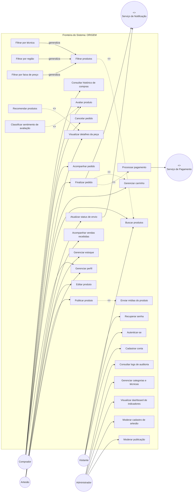
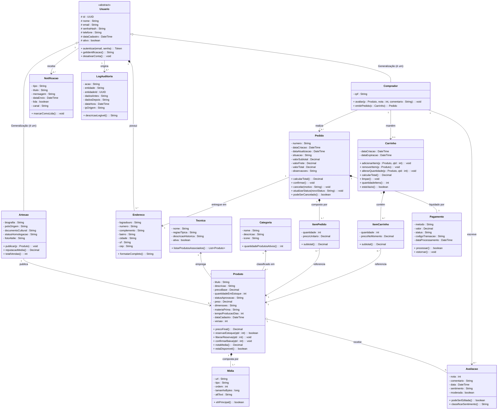

# 📐 02. Modelagem Conceitual (UML)

### Projeto Integrador IV · Marketplace Origem
**Disciplina:** Requisitos, Projeto de Software e Validação (ADS020) · **Semestre:** 2026.2  
**Referência Metodológica:** Larman, Fowler, Visual Paradigm, OMG UML 2.5.1

---

## 1. O que é o Modelo Conceitual?

O **Modelo Conceitual** transforma o conhecimento estruturado da Análise de Domínio em representações formais e visuais verificáveis. Ele é agnóstico a decisões técnicas de implementação:

| O Modelo Conceitual Responde | O Modelo Conceitual NÃO Responde |
| :--- | :--- |
| • Quais conceitos existem no domínio e seus nomes oficiais. • Quem interage com o sistema e qual valor obtém. • Quais regras governam as relações antes de qualquer código. • O que está dentro e fora da fronteira do escopo. | • Qual framework web, banco de dados ou linguagem usar. • Qual o layout visual exato da tela. • Como os endpoints REST e JSONs são formatados. • Como as tabelas e índices físicos são organizados. |

---

## 2. Diagrama de Casos de Uso (Visão Comportamental)

O Diagrama de Casos de Uso descreve o sistema pela sua borda: os **atores**, suas **funções observáveis** e os **relacionamentos formais** (`<<include>>`, `<<extend>>` e `generalização`).

### Especificação dos Casos de Uso

| Caso de Uso | Ator Principal | Relacionamento | Justificativa |
| :--- | :--- | :--- | :--- |
| **Cadastrar conta** | Visitante | Base | Ponto de entrada obrigatório; sem identidade não há operações autenticadas. |
| **Autenticar-se** | Visitante | Base | Geração de sessão/token para acesso às funcionalidades restritas por perfil (RBAC). |
| **Recuperar senha** | Visitante | Base | Fluxo de autosserviço para recuperação segura de acesso à conta. |
| **Gerenciar perfil** | Comprador / Artesão | Base | Atualização de dados pessoais, endereço, biografia (artesão) e preferências. |
| **Buscar produtos** | Visitante / Comprador | Base | Consulta textual livre no catálogo público da vitrine. |
| **Filtrar produtos** | Visitante / Comprador | `<<extend>>` Buscar | Refinamento opcional com critérios combinados (região, técnica, preço). |
| **Filtrar por técnica / região / preço** | Visitante / Comprador | Generalização de Filtrar | Especializações da filtragem com regras de domínio próprias. |
| **Visualizar detalhes da peça** | Comprador | Base | Acesso à ficha técnica, galeria, biografia do artesão e histórico de avaliações. |
| **Gerenciar carrinho** | Comprador | Base | Adição, remoção, atualização de quantidade e visualização resumida do carrinho temporário. |
| **Finalizar pedido** | Comprador | `<<include>>` Processar pagamento, Gerenciar carrinho | Fechamento transacional com reserva atômica de estoque de todos os itens do carrinho. |
| **Processar pagamento** | Serviço de Pagamento (ext.) | Incluído por Finalizar pedido | Liquidação simulada (Cartão/PIX) com retorno de aprovação ou recusa. |
| **Acompanhar pedido** | Comprador | Base | Visualização do status atualizado do pedido (*Confirmado → Em Preparação → Enviado → Entregue*). |
| **Cancelar pedido** | Comprador | Base | Solicitação de cancelamento dentro da janela permitida (antes do envio), com estorno de estoque. |
| **Avaliar produto** | Comprador | Base | Registro de nota (1–5) e comentário textual após recebimento confirmado. |
| **Consultar histórico de compras** | Comprador | Base | Listagem completa e paginada de todos os pedidos anteriores com respectivos status. |
| **Publicar produto** | Artesão | `<<include>>` Enviar mídias | Cadastro de nova peça com dados obrigatórios e mídias de evidência visual. |
| **Editar produto** | Artesão | Base | Alteração de dados, preço e mídias de um produto já publicado (resubmissão para moderação se necessário). |
| **Gerenciar estoque** | Artesão | Base | Atualização do saldo disponível de uma ou mais peças do ateliê. |
| **Acompanhar vendas recebidas** | Artesão | Base | Painel com pedidos recebidos, itens vendidos, faturamento acumulado e peças mais populares. |
| **Atualizar status de envio** | Artesão | Base | Transição de status logístico (*Em Preparação → Enviado → Entregue*) com notificação ao comprador. |
| **Moderar publicação** | Administrador | Base | Aprovação, recusa ou solicitação de ajuste de peças pendentes de curadoria. |
| **Moderar cadastro de artesão** | Administrador | Base | Validação de autenticidade do artesão (documentos, polo, técnica). |
| **Visualizar dashboard** | Administrador | Base | Métricas consolidadas: volume de vendas por polo, técnicas mais procuradas, ticket médio, artesãos ativos. |
| **Gerenciar categorias e técnicas** | Administrador | Base | CRUD de taxonomia oficial de técnicas artesanais e categorias de produtos. |
| **Consultar logs de auditoria** | Administrador | Base | Rastreamento de ações sensíveis (alterações de estoque, moderações, cancelamentos). |
| **Recomendar produtos** | Sistema (IA) | `<<extend>>` Visualizar detalhes | Sugestão automática de peças semelhantes por técnica, região ou comportamento de navegação. |
| **Classificar sentimento** | Sistema (IA) | `<<extend>>` Avaliar produto | Análise automática do texto do comentário para classificação de sentimento. |

---

## 3. Diagrama de Classes Conceitual (Estrutura Estática)

O Diagrama de Classes descreve os conceitos estáveis do negócio, seus atributos com tipos, suas operações e as regras de ciclo de vida (composição vs associação).

### Relacionamentos e Ciclo de Vida:
* **Generalização (`Usuario` → `Artesao` e `Comprador`):** Especialização de perfil com atributos e comportamentos próprios.
* **Composição (`Pedido` ◆→ `ItemPedido` e `Pagamento`):** Se o pedido é destruído, seus itens e registro de pagamento desaparecem.
* **Composição (`Produto` ◆→ `Midia`):** Mídias pertencem exclusivamente ao ciclo de vida do produto.
* **Composição (`Carrinho` ◆→ `ItemCarrinho`):** O carrinho governa o ciclo de seus itens temporários.
* **Composição (`Usuario` ◆→ `Endereco`):** Endereços são parte integrante do perfil do usuário.
* **Agregação (`Produto` ◇→ `Avaliacao`):** Avaliações vinculam comprador e produto de forma independente; a remoção do produto não deveria destruir o histórico de avaliações pendentes de análise.
* **Associação (`Pedido` → `Endereco`):** O pedido referencia o endereço de entrega vigente no momento da compra (snapshot).
* **Associação (`Usuario` → `Notificacao` e `LogAuditoria`):** Rastreabilidade e comunicação assíncrona com o usuário.

---

## 4. Matriz de Coerência entre os Modelos (Verificação Cruzada)

> [!NOTE]
> **Critério de Consistência:** Todo caso de uso deve manipular ao menos uma classe do modelo, e toda classe deve participar de ao menos um caso de uso.

| Caso de Uso (Borda) | Classes Manipuladas (Interior) | Operações / Atributos Envolvidos |
| :--- | :--- | :--- |
| **Cadastrar conta** | `Usuario`, `Artesao` ou `Comprador`, `Endereco` | Instanciação de `Usuario` com especialização e composição de `Endereco`. |
| **Autenticar-se** | `Usuario` | `Usuario.autenticar()`, leitura de `senhaHash` e geração de token. |
| **Recuperar senha** | `Usuario`, `Notificacao` | Geração de token de recuperação e envio de `Notificacao` por e-mail. |
| **Gerenciar perfil** | `Usuario`, `Artesao`, `Comprador`, `Endereco` | Atualização de atributos pessoais e CRUD de endereços. |
| **Buscar produtos** | `Produto`, `Tecnica`, `Artesao`, `Categoria` | Leitura de `titulo`, `descricao`, `poloOrigem`, `Tecnica.nome`, `Categoria.nome`. |
| **Filtrar produtos (Técnica / Região / Preço)** | `Produto`, `Tecnica`, `Artesao`, `Categoria` | Filtragem combinada por múltiplos atributos. |
| **Visualizar detalhes da peça** | `Produto`, `Midia`, `Artesao`, `Tecnica`, `Avaliacao` | Leitura completa da ficha, galeria, biografia e nota média. |
| **Gerenciar carrinho** | `Carrinho`, `ItemCarrinho`, `Produto` | `adicionarItem()`, `removerItem()`, `alterarQuantidade()`, validação de `estaDisponivel()`. |
| **Finalizar pedido** | `Carrinho`, `Pedido`, `ItemPedido`, `Produto`, `Pagamento`, `Endereco`, `Notificacao`, `LogAuditoria` | Conversão de carrinho em pedido, `reservarEstoque()`, `confirmarBaixa()`, criação de `Pagamento`, disparo de `Notificacao`. |
| **Processar pagamento** | `Pagamento`, `Pedido` | `Pagamento.processar()`, atualização de `Pedido.situacao`. |
| **Acompanhar pedido** | `Pedido`, `ItemPedido` | Leitura de `situacao`, `dataAtualizacao` e itens associados. |
| **Cancelar pedido** | `Pedido`, `Produto`, `Pagamento`, `LogAuditoria` | `Pedido.cancelar()`, `Produto.liberarReserva()`, `Pagamento.estornar()`. |
| **Avaliar produto** | `Comprador`, `Produto`, `Avaliacao` | `Comprador.avaliar()`, instanciação de `Avaliacao`, cálculo de `notaMedia()`. |
| **Consultar histórico de compras** | `Comprador`, `Pedido`, `ItemPedido` | Listagem paginada de pedidos e seus itens. |
| **Publicar produto** | `Artesao`, `Produto`, `Midia`, `Tecnica`, `Categoria` | `Artesao.publicar()`, composição de `Midia`, vinculação de `Tecnica` e `Categoria`. |
| **Editar produto** | `Artesao`, `Produto`, `Midia`, `LogAuditoria` | Atualização de atributos, resubmissão de `statusAprovacao`, registro de auditoria. |
| **Gerenciar estoque** | `Artesao`, `Produto`, `LogAuditoria` | Atualização de `quantidadeEmEstoque` com registro de auditoria. |
| **Acompanhar vendas recebidas** | `Artesao`, `Pedido`, `ItemPedido`, `Produto` | Leitura de pedidos contendo itens do artesão, cálculo de `totalVendas()`. |
| **Atualizar status de envio** | `Artesao`, `Pedido`, `Notificacao` | `Pedido.atualizarStatus()`, disparo de `Notificacao` ao comprador. |
| **Moderar publicação** | `Produto`, `LogAuditoria` | Atualização de `statusAprovacao` com justificativa registrada. |
| **Moderar cadastro de artesão** | `Artesao`, `LogAuditoria` | Atualização de `statusHomologacao` com auditoria. |
| **Visualizar dashboard** | `Pedido`, `Produto`, `Artesao`, `Tecnica`, `Categoria` | Agregações: volume por polo, técnicas mais vendidas, ticket médio, artesãos ativos. |
| **Gerenciar categorias e técnicas** | `Categoria`, `Tecnica`, `LogAuditoria` | CRUD com auditoria de alterações na taxonomia oficial. |
| **Consultar logs de auditoria** | `LogAuditoria` | Leitura filtrada por período, ator, entidade e ação. |
| **Recomendar produtos** | `Produto`, `Tecnica`, `Artesao`, `Avaliacao` | Cálculo de similaridade por técnica, polo e padrão de navegação. |
| **Classificar sentimento** | `Avaliacao` | Processamento de NLP sobre `comentario`, atualização de `sentimento`. |

> [!TIP]
> **Cobertura total verificada:** Todas as 14 classes do modelo são manipuladas por ao menos um caso de uso, e todos os 27 casos de uso tocam ao menos uma classe.
