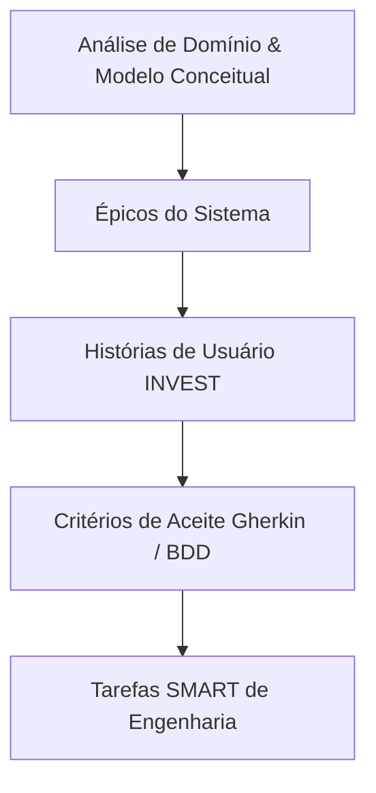

# 📝 03. Histórias de Usuário e Critérios de Aceite (BDD)

### Projeto Integrador IV · Marketplace Origem
**Disciplina:** Requisitos, Projeto de Software e Validação (ADS020) · **Semestre:** 2026.2  
**Referência Metodológica:** Mike Cohn, Bill Wake (INVEST), Adzic (Specification by Example), Cucumber Gherkin

---

## 1. Do Domínio ao Backlog: O Fatiamento Vertical

Uma História de Usuário (HU) representa uma fatia vertical de valor de negócio observável, atravessando todas as camadas da aplicação (banco, backend, regras e interface), em oposição a divisões puramente técnicas.



### Os 3 C's da História de Usuário:
1. **Cartão (Card):** O texto curto padronizado (*Como... Quero... Para...*).
2. **Conversa (Conversation):** O diálogo entre a equipe e stakeholders para esclarecer regras, exceções e restrições.
3. **Confirmação (Confirmation):** Os Critérios de Aceite verificáveis que definem as condições de sucesso.

---

## 2. Mapa Completo de Épicos e Histórias

```mermaid
graph TD
    E1[Épico 1: Identidade e Acesso]
    E2[Épico 2: Descoberta Cultural e Vitrine]
    E3[Épico 3: Gestão do Ateliê e Catálogo]
    E4[Épico 4: Carrinho e Checkout Concorrente]
    E5[Épico 5: Ciclo de Vida do Pedido]
    E6[Épico 6: Avaliação e Pós-Venda]
    E7[Épico 7: Administração e Governança]
    E8[Épico 8: Inteligência Artificial]

    E1 --> HU01[HU-01: Cadastro de Conta]
    E1 --> HU02[HU-02: Autenticação]
    E1 --> HU03[HU-03: Recuperação de Senha]
    E1 --> HU04[HU-04: Gestão de Perfil e Endereços]

    E2 --> HU05[HU-05: Busca Textual no Catálogo]
    E2 --> HU06[HU-06: Filtro por Região de Origem]
    E2 --> HU07[HU-07: Filtro por Técnica Artesanal]
    E2 --> HU08[HU-08: Visualizar Detalhes e Storytelling]

    E3 --> HU09[HU-09: Publicação de Nova Peça]
    E3 --> HU10[HU-10: Edição de Peça Publicada]
    E3 --> HU11[HU-11: Gestão de Estoque]
    E3 --> HU12[HU-12: Painel de Vendas do Artesão]

    E4 --> HU13[HU-13: Gestão do Carrinho]
    E4 --> HU14[HU-14: Checkout com Baixa Concorrente]

    E5 --> HU15[HU-15: Acompanhamento de Pedido]
    E5 --> HU16[HU-16: Cancelamento de Pedido]
    E5 --> HU17[HU-17: Atualização de Status de Envio]

    E6 --> HU18[HU-18: Avaliação de Peça Adquirida]
    E6 --> HU19[HU-19: Histórico de Compras]

    E7 --> HU20[HU-20: Moderação de Publicações]
    E7 --> HU21[HU-21: Homologação de Artesãos]
    E7 --> HU22[HU-22: Dashboard de Indicadores]
    E7 --> HU23[HU-23: Auditoria de Ações]

    E8 --> HU24[HU-24: Recomendação Contextual]
    E8 --> HU25[HU-25: Análise de Sentimento]
```



---

## 3. Épicos e Histórias de Usuário — Especificação Completa

---

### 🔐 Épico 1: Identidade e Acesso

#### HU-01: Cadastro de Conta com Seleção de Perfil
> **Como** visitante,  
> **quero** criar uma conta escolhendo se sou comprador ou artesão,  
> **para** acessar as funcionalidades da plataforma correspondentes ao meu papel.

```gherkin
Cenário 1: Cadastro de comprador com dados válidos
Dado que acesso a página de cadastro
Quando seleciono o perfil "Comprador" e preencho nome "Maria", e-mail "maria@email.com", senha "Senha@123" e telefone "(81) 99999-0000"
E informo ao menos um endereço de entrega completo (logradouro, número, bairro, cidade, UF e CEP)
E clico em "Criar Conta"
Então a conta deve ser criada com sucesso
E o sistema deve enviar um e-mail de confirmação para "maria@email.com"
E devo ser redirecionada à tela inicial da vitrine autenticada

Cenário 2: Cadastro de artesão com dados complementares
Dado que acesso a página de cadastro
Quando seleciono o perfil "Artesão" e preencho os dados pessoais válidos
E informo biografia, polo de origem "Alto do Moura, Caruaru" e faço upload de foto do ateliê
E clico em "Criar Conta"
Então a conta deve ser criada com status de homologação "Pendente de Verificação"
E devo visualizar a mensagem: "Seu cadastro foi recebido e será analisado por nossa equipe de curadoria"

Cenário 3: Tentativa de cadastro com e-mail já existente
Dado que o e-mail "maria@email.com" já está cadastrado no sistema
Quando tento criar uma nova conta com o mesmo e-mail
Então o sistema deve bloquear a operação
E exibir a mensagem: "Este e-mail já está associado a uma conta existente"

Cenário 4: Validação de força de senha
Dado que estou preenchendo o formulário de cadastro
Quando informo uma senha com menos de 8 caracteres ou sem caracteres especiais
Então o sistema deve indicar que a senha não atende aos requisitos mínimos de segurança
E não permitir a submissão do formulário
```

---

#### HU-02: Autenticação Segura
> **Como** usuário cadastrado (comprador ou artesão),  
> **quero** autenticar-me com meu e-mail e senha,  
> **para** acessar meu perfil, meu carrinho e minhas funcionalidades restritas.

```gherkin
Cenário 1: Login com credenciais válidas
Dado que possuo uma conta ativa com e-mail "joao@email.com" e senha "Senha@456"
Quando informo as credenciais corretas na tela de login e clico em "Entrar"
Então devo ser autenticado com sucesso
E redirecionado ao painel correspondente ao meu perfil (vitrine para comprador, ateliê para artesão)
E o token de sessão deve ser gerado com expiração de 24 horas

Cenário 2: Tentativa de login com credenciais inválidas
Dado que informo e-mail "joao@email.com" e senha "senhaerrada"
Quando clico em "Entrar"
Então o sistema deve exibir: "E-mail ou senha incorretos"
E não deve revelar se o e-mail existe ou não na base (proteção contra enumeração)

Cenário 3: Bloqueio temporário por excesso de tentativas
Dado que errei a senha 5 vezes consecutivas para o mesmo e-mail
Quando tentar uma 6ª vez
Então o sistema deve bloquear novas tentativas por 15 minutos
E exibir: "Conta temporariamente bloqueada por excesso de tentativas. Tente novamente em 15 minutos"

Cenário 4: Artesão ainda não homologado tenta acessar o painel
Dado que minha conta de artesão possui status "Pendente de Verificação"
Quando me autentico com credenciais válidas
Então devo visualizar uma tela informativa de que meu cadastro está em análise
E não devo conseguir acessar funcionalidades de publicação de peças
```

---

#### HU-03: Recuperação de Senha
> **Como** usuário que esqueceu sua senha,  
> **quero** solicitar a redefinição da senha via e-mail,  
> **para** recuperar o acesso à minha conta de forma segura.

```gherkin
Cenário 1: Solicitação de recuperação com e-mail cadastrado
Dado que informo "joao@email.com" no formulário de recuperação
Quando clico em "Enviar Link de Recuperação"
Então o sistema deve enviar um e-mail com link de redefinição válido por 1 hora
E exibir: "Se o e-mail informado estiver cadastrado, você receberá as instruções de recuperação"

Cenário 2: Link de recuperação expirado
Dado que recebi o link de redefinição há mais de 1 hora
Quando clico no link e tento definir uma nova senha
Então o sistema deve informar que o link expirou
E sugerir que eu solicite um novo link de recuperação
```

---

#### HU-04: Gestão de Perfil e Endereços
> **Como** usuário autenticado,  
> **quero** editar meus dados pessoais e gerenciar meus endereços de entrega,  
> **para** manter minhas informações atualizadas para futuras compras.

```gherkin
Cenário 1: Atualização de dados pessoais
Dado que estou autenticado e acesso a página "Meu Perfil"
Quando altero meu telefone para "(81) 98888-1111" e clico em "Salvar"
Então o sistema deve persistir a alteração com sucesso
E exibir mensagem de confirmação

Cenário 2: Adição de novo endereço de entrega
Dado que possuo 1 endereço cadastrado
Quando clico em "Adicionar Endereço" e preencho os campos obrigatórios (logradouro, número, bairro, cidade, UF, CEP)
Então o novo endereço deve ser salvo com sucesso
E aparecer na listagem de endereços com opção de marcar como principal

Cenário 3: Artesão atualiza biografia e polo cultural
Dado que estou autenticado como artesão
Quando edito o campo "Biografia" para incluir o histórico da minha família artesã
E altero o polo de origem para "Tracunhaém"
Então as alterações devem ser persistidas com sucesso
E refletir na minha página pública do ateliê
```

---

### 🎨 Épico 2: Descoberta Cultural e Vitrine (Comprador)

#### HU-05: Busca Textual no Catálogo
> **Como** visitante ou comprador,  
> **quero** pesquisar peças artesanais por palavras-chave (nome da peça, nome do artesão ou região),  
> **para** encontrar rapidamente o que procuro no catálogo.

```gherkin
Cenário 1: Busca textual com resultados correspondentes
Dado que existem peças com o termo "xilogravura" no título ou descrição
Quando digito "xilogravura" no campo de busca e pressiono Enter
Então devo visualizar a listagem com todas as peças correspondentes ordenadas por relevância
E o campo de busca deve manter o termo digitado para referência

Cenário 2: Busca sem resultados correspondentes
Dado que não existem peças com o termo "porcelana chinesa" no catálogo
Quando digito "porcelana chinesa" e pressiono Enter
Então devo visualizar a mensagem: "Nenhum resultado encontrado para 'porcelana chinesa'"
E o sistema deve sugerir termos alternativos ou técnicas populares

Cenário 3: Busca por nome do artesão
Dado que o artesão "Mestre Zé Caboclo" possui 5 peças ativas
Quando digito "Zé Caboclo" no campo de busca
Então devo visualizar as 5 peças do artesão nos resultados
E um link direto para o perfil do ateliê do mestre
```

---

#### HU-06: Filtro de Peças por Região de Origem
> **Como** compradora apreciadora de arte popular,  
> **quero** filtrar as peças da vitrine por polo/região de origem de Pernambuco,  
> **para** encontrar e valorizar produções de territórios culturais específicos que me interessam.

```gherkin
Cenário 1: Filtro por região com resultados existentes (Caminho Feliz)
Dado que existem 12 peças publicadas com a região "Alto do Moura, Caruaru"
E que estou visualizando a vitrine principal
Quando eu aplicar o filtro para a região "Alto do Moura, Caruaru"
Então devo visualizar apenas as 12 peças pertencentes a essa região
E o contador de resultados da página deve exibir exatamente "12 peças encontradas"

Cenário 2: Região selecionada sem peças ativas no catálogo
Dado que não existem peças publicadas cadastradas na região "Sertão de Itaparica"
Quando eu selecionar essa região no filtro da vitrine
Então devo visualizar a mensagem: "Nenhuma peça artesanal disponível para esta região no momento"
E devo visualizar uma listagem de sugestão com as outras regiões que possuem peças disponíveis

Cenário 3: Combinação cumulativa de filtros (Região + Técnica)
Dado que selecionei previamente o filtro de técnica "Cerâmica Figurativa"
Quando eu adicionar o filtro de região "Tracunhaém"
Então devo visualizar apenas peças que sejam simultaneamente de "Cerâmica Figurativa" E de "Tracunhaém"
E ambos os filtros devem permanecer destacados na interface com opção de remoção individual

Cenário 4: Exibição de peça com estoque esgotado dentro do resultado filtrado
Dado que uma peça pertencente à região filtrada possui estoque zero
Quando a listagem for renderizada na vitrine
Então a peça deve permanecer visível com a etiqueta visual "Esgotada"
E o botão de "Adicionar ao Carrinho" deve estar desabilitado
```

---

#### HU-07: Filtro por Técnica Artesanal
> **Como** comprador,  
> **quero** filtrar peças por técnica artesanal (ex: Cerâmica, Renda, Xilogravura, Marcenaria),  
> **para** explorar obras produzidas com a mesma tradição manual que me interessa.

```gherkin
Cenário 1: Filtro por técnica com resultados
Dado que existem 7 peças classificadas com a técnica "Renda Renascença"
Quando seleciono "Renda Renascença" no painel de filtros
Então devo visualizar exatamente 7 peças nos resultados

Cenário 2: Combinação de filtro por técnica com faixa de preço
Dado que apliquei o filtro "Cerâmica Figurativa"
Quando adiciono o filtro de faixa de preço "R$ 50 a R$ 200"
Então devo visualizar apenas peças de cerâmica dentro da faixa de preço informada
E o sistema deve exibir a quantidade de resultados filtrados
```

---

#### HU-08: Visualização de Detalhes e Storytelling da Peça
> **Como** comprador,  
> **quero** visualizar a página completa de detalhes de uma peça, incluindo fotos, ficha técnica, biografia do artesão e avaliações de outros compradores,  
> **para** compreender o valor cultural e a autenticidade da obra antes de decidir a compra.

```gherkin
Cenário 1: Visualização completa com todos os dados preenchidos
Dado que acesso a página da peça "Boneco Mestre Vitalino"
Quando a página terminar de carregar
Então devo visualizar a galeria com todas as fotos cadastradas em carrossel interativo
E a seção "Sobre o Mestre" contendo nome do artesão, polo cultural, foto do ateliê e biografia resumida
E a ficha técnica contendo dimensões, peso, técnica aplicada, matéria-prima e tempo estimado de produção
E a seção de avaliações com nota média e listagem de comentários de compradores anteriores
E a indicação de estoque disponível ("Última unidade!" se estoque = 1)

Cenário 2: Navegação para o perfil público do artesão
Dado que estou na página de detalhes da peça
Quando eu clicar no nome ou foto do artesão
Então devo ser direcionado para a página do ateliê do artesão
E visualizar todas as outras obras ativas cadastradas por ele
E sua nota média consolidada de todas as avaliações

Cenário 3: Peça sem avaliações anteriores
Dado que a peça "Cesto em Fibra Natural" não possui avaliações
Quando visualizo sua página de detalhes
Então a seção de avaliações deve exibir: "Esta peça ainda não possui avaliações. Seja o primeiro a avaliar!"
E a nota média não deve ser exibida numericamente
```

---

### 🪵 Épico 3: Gestão do Ateliê e Catálogo (Artesão)

#### HU-09: Publicação de Nova Peça Artesanal
> **Como** artesão homologado,  
> **quero** cadastrar uma nova peça informando título, descrição, técnica, categoria, preço, estoque, fotos e dados de feitura,  
> **para** expor minha produção artística na vitrine para compradores de todo o Brasil.

```gherkin
Cenário 1: Cadastro completo com todos os dados válidos
Dado que estou autenticado como artesão homologado no painel do ateliê
Quando preencho o título "Quadro em Xilogravura M", descrição, preço R$ 150.00, técnica "Xilogravura", categoria "Decoração", estoque 2, matéria-prima "Madeira Umburana", tempo de produção "7 dias" e anexo 3 fotos válidas com texto alternativo de acessibilidade
E clico em "Publicar Peça"
Então a peça deve ser salva com sucesso
E o status inicial deve ser registrado como "Pendente de Moderação"
E devo visualizar a mensagem: "Peça cadastrada com sucesso e enviada para curadoria"
E um registro de auditoria deve ser gerado com os dados do cadastro

Cenário 2: Tentativa de publicação sem imagens
Dado que estou preenchendo o cadastro de uma nova peça
Quando deixo o campo de upload de imagens vazio e clico em "Publicar Peça"
Então o sistema deve bloquear o envio
E exibir a mensagem de validação: "É obrigatório anexar ao menos uma fotografia da peça"

Cenário 3: Validação de preço mínimo
Dado que preencho o campo de preço com "R$ 0,00"
Quando clico em "Publicar Peça"
Então o sistema deve bloquear e exibir: "O preço mínimo de uma peça é R$ 1,00"

Cenário 4: Upload de imagem com tamanho excessivo
Dado que tento fazer upload de uma foto com 15 MB
Quando o arquivo é selecionado
Então o sistema deve rejeitar o arquivo
E exibir: "A imagem deve ter no máximo 5 MB. Reduza o tamanho e tente novamente"
```

---

#### HU-10: Edição de Peça Já Publicada
> **Como** artesão,  
> **quero** editar os dados de uma peça que já publiquei (título, preço, fotos, descrição),  
> **para** corrigir informações ou atualizar o preço conforme a sazonalidade.

```gherkin
Cenário 1: Edição de campo que exige reaprovação
Dado que minha peça "Vaso Cerâmico" está com status "Aprovada"
Quando altero o título para "Vaso Cerâmico Grande" e clico em "Salvar Alterações"
Então a peça deve voltar ao status "Pendente de Moderação"
E eu devo ser informado: "A alteração de título requer nova aprovação da curadoria"
E um registro de auditoria com os dados antigos e novos deve ser gerado

Cenário 2: Edição de preço sem necessidade de reaprovação
Dado que minha peça está com status "Aprovada"
Quando altero apenas o preço de R$ 180.00 para R$ 200.00 e clico em "Salvar"
Então o preço deve ser atualizado imediatamente na vitrine
E a peça deve permanecer com status "Aprovada"
```

---

#### HU-11: Gestão de Estoque do Ateliê
> **Como** artesão,  
> **quero** ajustar a quantidade disponível das peças do meu ateliê de forma ágil,  
> **para** sincronizar meu estoque digital quando uma peça for vendida presencialmente ou produzir novas unidades.

```gherkin
Cenário 1: Baixa manual de estoque por venda presencial
Dado que possuo a peça "Vaso de Barro" com 3 unidades em estoque
Quando altero a quantidade para 1 no painel e clico em "Salvar"
Então o sistema deve atualizar o estoque para 1 unidade
E refletir a nova quantidade na vitrine em até 5 segundos
E gerar um registro de auditoria: "Estoque alterado de 3 para 1 (motivo: ajuste manual)"

Cenário 2: Tentativa de informar estoque negativo
Dado que estou editando o estoque de uma peça
Quando informo o valor "-1" no campo de quantidade
Então o sistema deve recusar a operação
E exibir a mensagem: "A quantidade em estoque não pode ser negativa"

Cenário 3: Alerta de estoque crítico
Dado que uma peça possui 1 unidade em estoque
Quando visualizo o painel do ateliê
Então a peça deve estar destacada com o indicador "Última unidade"
E eu devo ter recebido uma notificação de alerta de estoque crítico
```

---

#### HU-12: Painel de Vendas do Artesão
> **Como** artesão,  
> **quero** acompanhar os pedidos que contêm minhas peças, incluindo valores, status e dados do comprador,  
> **para** organizar minha produção, embalar e despachar os pedidos de forma eficiente.

```gherkin
Cenário 1: Visualização de pedidos recebidos
Dado que 3 compradores realizaram pedidos contendo minhas peças
Quando acesso o painel "Minhas Vendas"
Então devo visualizar a listagem dos 3 pedidos com: data, número do pedido, nome do comprador, peças vendidas, quantidade e valor total do pedido
E os pedidos devem ser ordenados do mais recente para o mais antigo

Cenário 2: Detalhamento de um pedido com endereço de entrega
Dado que clico em um pedido específico no painel de vendas
Quando a página de detalhes é carregada
Então devo visualizar o endereço de entrega completo do comprador
E as peças que fazem parte daquele pedido com suas respectivas quantidades
E os botões de transição de status disponíveis
```

---

### 🛒 Épico 4: Carrinho e Checkout Concorrente

#### HU-13: Gestão do Carrinho de Compras
> **Como** comprador,  
> **quero** adicionar, remover e alterar a quantidade de peças no meu carrinho,  
> **para** compor meu pedido antes de finalizar a compra.

```gherkin
Cenário 1: Adição de peça ao carrinho
Dado que estou na página de detalhes da peça "Escultura em Barro" com estoque = 3
Quando clico em "Adicionar ao Carrinho" com quantidade 1
Então a peça deve ser adicionada ao carrinho com sucesso
E o ícone do carrinho na barra superior deve atualizar o contador para "1 item"

Cenário 2: Tentativa de adicionar peça esgotada
Dado que a peça "Quadro Único" possui estoque = 0
Quando clico em "Adicionar ao Carrinho"
Então o botão deve estar desabilitado com texto "Esgotado"
E nenhuma ação deve ocorrer

Cenário 3: Tentativa de adicionar quantidade superior ao estoque
Dado que a peça "Vaso de Barro" possui estoque = 2
Quando tento adicionar 5 unidades ao carrinho
Então o sistema deve limitar a quantidade a 2
E exibir: "Quantidade ajustada para o máximo disponível em estoque (2 unidades)"

Cenário 4: Remoção de item do carrinho
Dado que possuo 2 itens no carrinho
Quando clico em "Remover" no item "Escultura em Barro"
Então o item deve ser removido do carrinho
E o valor total deve ser recalculado automaticamente

Cenário 5: Carrinho com itens de múltiplos artesãos
Dado que adiciono 1 peça do artesão "Mestre Zé" e 1 peça da artesã "Dona Rita"
Quando visualizo o resumo do carrinho
Então os itens devem estar agrupados por artesão/ateliê
E o valor total deve somar os subtotais de ambos
```

---

#### HU-14: Finalização de Compra com Baixa Atômica Concorrente
> **Como** comprador,  
> **quero** finalizar o pedido dos itens do meu carrinho com garantia de reserva segura,  
> **para** assegurar que receberei as peças exclusivas sem risco de venda duplicada (*overselling*).

```gherkin
Cenário 1: Finalização bem-sucedida com estoque disponível (Caminho Feliz)
Dado que possuo 2 itens no carrinho: "Escultura Guerreiro" (estoque = 1) e "Vaso de Barro" (estoque = 3, quantidade = 2)
E que selecionei um endereço de entrega e confirmei os dados de pagamento simulado
Quando clico em "Concluir Pedido"
Então o sistema deve debitar atomicamente 1 unidade de "Escultura Guerreiro" e 2 unidades de "Vaso de Barro"
E registrar o pedido com situação "Confirmado"
E gerar um número único de pedido (ex: "ORG-20260826-0001")
E despachar tarefas assíncronas para: notificação ao(s) artesão(ões), geração de comprovante e atualização de métricas
E limpar o carrinho do comprador
E exibir a tela de confirmação com resumo do pedido

Cenário 2: Disputa concorrente pela mesma peça única (Race Condition — FCCPD)
Dado que dois compradores (A e B) possuem a mesma peça única (estoque = 1) no checkout
Quando ambos confirmarem o pagamento no mesmo instante
E a transação do Comprador A for processada e confirmada primeiro
Então o Comprador A recebe a confirmação do pedido com sucesso
E a transação do Comprador B é rejeitada com estorno imediato
E o Comprador B visualiza: "A peça 'Escultura Guerreiro' foi adquirida por outro comprador durante o seu checkout"
E o estoque final do produto deve permanecer exatamente zero (nunca negativo)

Cenário 3: Falha parcial na baixa de um dos itens do carrinho multi-artesão
Dado que o carrinho contém 3 itens de 2 artesãos diferentes
E um dos itens ficou esgotado entre a visualização do carrinho e a finalização
Quando clico em "Concluir Pedido"
Então o sistema deve rejeitar a transação inteira (atomicidade total)
E reverter quaisquer reservas parciais já realizadas nos demais itens
E informar ao comprador qual item ficou indisponível
E manter os demais itens no carrinho para nova tentativa

Cenário 4: Pedido com pagamento recusado
Dado que completei o checkout mas o serviço de pagamento simulado retorna "Recusado"
Quando a resposta de pagamento é processada
Então o sistema deve reverter todas as reservas de estoque
E manter o pedido com situação "Pagamento Recusado"
E manter os itens no carrinho
E exibir: "Não foi possível processar o pagamento. Verifique os dados e tente novamente"
```

---

### 📦 Épico 5: Ciclo de Vida do Pedido

#### HU-15: Acompanhamento de Pedido pelo Comprador
> **Como** comprador,  
> **quero** acompanhar o status atualizado dos meus pedidos (Confirmado → Em Preparação → Enviado → Entregue),  
> **para** saber a situação atual e me preparar para o recebimento.

```gherkin
Cenário 1: Visualização do status atual
Dado que realizei um pedido que está com status "Em Preparação"
Quando acesso a página "Meus Pedidos" e clico no pedido
Então devo visualizar o timeline do pedido com os estados: Confirmado ✓ → Em Preparação (atual) → Enviado → Entregue
E a data e hora de cada transição já ocorrida
E os dados do artesão responsável por cada item

Cenário 2: Notificação de mudança de status
Dado que o artesão atualizou meu pedido para "Enviado"
Quando acesso a plataforma
Então devo visualizar uma notificação informando a atualização
E ao clicar na notificação devo ser levado aos detalhes do pedido
```

---

#### HU-16: Cancelamento de Pedido
> **Como** comprador,  
> **quero** cancelar um pedido que ainda não foi enviado,  
> **para** desistir da compra caso mude de ideia ou tenha cometido um erro.

```gherkin
Cenário 1: Cancelamento permitido (status "Confirmado" ou "Em Preparação")
Dado que meu pedido está com status "Confirmado"
Quando clico em "Cancelar Pedido" e confirmo a ação informando o motivo
Então o status do pedido deve mudar para "Cancelado"
E o estoque das peças do pedido deve ser restaurado integralmente
E o pagamento simulado deve ser registrado como "Estornado"
E o(s) artesão(ões) deve(m) ser notificado(s) do cancelamento
E um registro de auditoria deve ser gerado com o motivo

Cenário 2: Cancelamento bloqueado (status "Enviado" ou "Entregue")
Dado que meu pedido está com status "Enviado"
Quando tento cancelar o pedido
Então o sistema deve bloquear a operação
E exibir: "Não é possível cancelar pedidos já enviados. Entre em contato com o artesão"
```

---

#### HU-17: Atualização de Status de Envio pelo Artesão
> **Como** artesão,  
> **quero** atualizar o status logístico dos pedidos que contêm minhas peças,  
> **para** informar ao comprador que estou preparando, que já enviei ou que o pedido foi entregue.

```gherkin
Cenário 1: Transição de "Confirmado" para "Em Preparação"
Dado que recebi um pedido com status "Confirmado" contendo minha peça "Vaso de Barro"
Quando clico em "Iniciar Preparação"
Então o status do pedido deve mudar para "Em Preparação"
E o comprador deve receber uma notificação: "Seu pedido está sendo preparado pelo artesão"

Cenário 2: Transição de "Em Preparação" para "Enviado"
Dado que o pedido está com status "Em Preparação"
Quando clico em "Marcar como Enviado"
Então o status deve mudar para "Enviado"
E o comprador deve ser notificado com: "Sua peça foi despachada!"

Cenário 3: Tentativa de pular etapa de status
Dado que o pedido está com status "Confirmado"
Quando tento marcar diretamente como "Entregue"
Então o sistema deve bloquear e exibir: "O pedido precisa ser marcado como 'Em Preparação' e 'Enviado' antes de ser finalizado"
```

---

### ⭐ Épico 6: Avaliação e Pós-Venda

#### HU-18: Avaliação de Peça Adquirida
> **Como** comprador,  
> **quero** registrar uma avaliação com nota (1 a 5) e comentário textual para peças que adquiri,  
> **para** ajudar outros compradores na decisão e reconhecer o trabalho do artesão.

```gherkin
Cenário 1: Avaliação de peça entregue
Dado que o pedido contendo a peça "Vaso de Barro" possui status "Entregue"
Quando acesso a página da peça e preencho nota 5 e comentário "Peça belíssima, acabamento impecável"
E clico em "Enviar Avaliação"
Então a avaliação deve ser registrada com sucesso
E a nota média do produto deve ser recalculada
E a avaliação deve aparecer na página do produto para outros compradores

Cenário 2: Tentativa de avaliar peça de pedido não entregue
Dado que meu pedido está com status "Em Preparação"
Quando tento avaliar uma peça do pedido
Então o sistema deve bloquear e exibir: "Você poderá avaliar este produto após a confirmação de entrega"

Cenário 3: Tentativa de avaliar a mesma peça duas vezes
Dado que já avaliei a peça "Vaso de Barro" do pedido #123
Quando tento registrar uma nova avaliação para a mesma peça
Então o sistema deve informar: "Você já avaliou este produto. Deseja editar sua avaliação?"
E oferecer a opção de edição da avaliação existente

Cenário 4: Validação de conteúdo do comentário
Dado que preencho o campo de comentário com menos de 10 caracteres
Quando clico em "Enviar Avaliação"
Então o sistema deve solicitar: "Descreva sua experiência com pelo menos 10 caracteres"
```

---

#### HU-19: Consulta ao Histórico de Compras
> **Como** comprador,  
> **quero** consultar o histórico completo de todos os meus pedidos anteriores,  
> **para** acompanhar minhas aquisições, consultar detalhes e reavaliar peças.

```gherkin
Cenário 1: Listagem paginada de pedidos
Dado que realizei 15 pedidos nos últimos 6 meses
Quando acesso "Meus Pedidos"
Então devo visualizar uma listagem paginada com 10 pedidos por página
E cada item deve exibir: número do pedido, data, valor total, status atual e imagem miniatura da primeira peça

Cenário 2: Filtro de pedidos por status
Dado que possuo pedidos com status "Entregue", "Enviado" e "Cancelado"
Quando aplico o filtro "Entregues"
Então devo visualizar apenas os pedidos com status "Entregue"
```

---

### 🛡️ Épico 7: Administração e Governança Cultural

#### HU-20: Moderação de Publicações de Peças
> **Como** administrador,  
> **quero** aprovar, recusar ou solicitar ajustes em peças pendentes de moderação,  
> **para** garantir a autenticidade cultural e a qualidade do catálogo da plataforma.

```gherkin
Cenário 1: Aprovação de peça autêntica
Dado que a peça "Boneco em Barro" do artesão "Mestre Zé" está com status "Pendente de Moderação"
Quando verifico as fotos, técnica e biografia e clico em "Aprovar Publicação"
Então o status da peça deve mudar para "Aprovada"
E a peça deve aparecer imediatamente na vitrine pública
E o artesão deve ser notificado: "Sua peça foi aprovada e já está disponível na vitrine"
E um registro de auditoria deve ser gerado com o nome do moderador e a ação

Cenário 2: Recusa com justificativa obrigatória
Dado que a peça submetida não corresponde às diretrizes de autenticidade cultural
Quando clico em "Recusar" e informo a justificativa: "A peça não apresenta evidências de técnica artesanal tradicional"
Então o status da peça deve mudar para "Recusada"
E o artesão deve ser notificado com a justificativa para correção
E a peça não deve aparecer na vitrine pública

Cenário 3: Tentativa de recusa sem justificativa
Dado que clico em "Recusar" sem preencher o campo de justificativa
Quando submeto a moderação
Então o sistema deve bloquear e exibir: "É obrigatório informar a justificativa da recusa"
```

---

#### HU-21: Homologação de Cadastro de Artesão
> **Como** administrador,  
> **quero** validar o cadastro de novos artesãos analisando polo, técnica, biografia e documentos culturais,  
> **para** assegurar que apenas produtores culturais autênticos tenham acesso à publicação de peças.

```gherkin
Cenário 1: Homologação de artesão autêntico
Dado que o artesão "Dona Rita" possui cadastro "Pendente de Verificação"
Quando verifico a biografia, polo "Tracunhaém", técnica "Cerâmica Utilitária" e foto do ateliê
E clico em "Aprovar Artesão"
Então o status deve mudar para "Homologado"
E o artesão deve ser notificado: "Seu cadastro foi aprovado! Você já pode publicar suas peças"
E o artesão deve passar a ter acesso às funcionalidades de publicação

Cenário 2: Rejeição de artesão com cadastro insuficiente
Dado que o cadastro não possui foto do ateliê nem biografia
Quando clico em "Solicitar Complemento"
Então o artesão deve ser notificado com as pendências identificadas
E o status deve permanecer "Pendente de Verificação"
```

---

#### HU-22: Dashboard de Indicadores Culturais e Comerciais
> **Como** administrador,  
> **quero** visualizar um painel de indicadores com métricas consolidadas de vendas, artesãos, técnicas e regiões,  
> **para** tomar decisões informadas sobre curadoria, marketing e fomento cultural.

```gherkin
Cenário 1: Visualização de métricas consolidadas
Dado que acesso o painel administrativo
Quando clico em "Dashboard"
Então devo visualizar os indicadores: total de artesãos ativos, total de peças aprovadas, volume total de vendas (R$), ticket médio, top 5 técnicas mais vendidas e top 5 polos mais ativos
E os dados devem refletir o período selecionado (últimos 30 dias por padrão)

Cenário 2: Filtro por período
Dado que estou no dashboard
Quando altero o período para "Últimos 7 dias"
Então todos os indicadores devem ser recalculados para o intervalo selecionado
```

---

#### HU-23: Consulta aos Logs de Auditoria
> **Como** administrador,  
> **quero** consultar os registros de auditoria de ações sensíveis (alterações de estoque, moderações, cancelamentos),  
> **para** rastrear e investigar atividades irregulares na plataforma.

```gherkin
Cenário 1: Busca de logs por tipo de ação
Dado que acesso a página de auditoria
Quando filtro por ação "Moderação de Publicação" e período "Agosto 2026"
Então devo visualizar todos os registros de moderação daquele mês
E cada registro deve exibir: data/hora, ator, ação, entidade afetada e dados antes/depois

Cenário 2: Exportação de logs para análise externa
Dado que apliquei filtros na lista de auditoria
Quando clico em "Exportar CSV"
Então o sistema deve gerar e fazer download de um arquivo CSV contendo todos os registros filtrados
```

---

### 🧠 Épico 8: Inteligência Artificial e Recomendação

#### HU-24: Recomendação Contextual de Peças Afins
> **Como** compradora,  
> **quero** visualizar sugestões de peças artesanais semelhantes baseadas na técnica, polo e comportamento de navegação,  
> **para** descobrir outros mestres e obras com identidade estética compatível.

```gherkin
Cenário 1: Recomendação por técnica e polo (Baseline — Content-Based)
Dado que estou na página de uma peça de cerâmica do "Alto do Moura"
Quando a seção "Você também pode gostar" for renderizada
Então deve apresentar até 6 peças de cerâmica ou da mesma região
E nenhuma das peças recomendadas pode ser o próprio produto exibido
E peças com estoque esgotado não devem aparecer nas recomendações

Cenário 2: Recomendação comportamental (Fase 2 — Collaborative Filtering)
Dado que compradores que visualizaram a peça "Xilogravura A" frequentemente também compraram "Xilogravura B"
Quando visualizo a peça "Xilogravura A"
Então "Xilogravura B" deve aparecer na seção de recomendações com prioridade
```

---

#### HU-25: Análise Automática de Sentimento de Avaliações
> **Como** administrador,  
> **quero** que o sistema classifique automaticamente o sentimento (Positivo, Neutro, Negativo) dos comentários de avaliação,  
> **para** monitorar a satisfação geral e identificar artesãos que precisam de suporte ou feedback corretivo.

```gherkin
Cenário 1: Classificação automática após submissão de avaliação
Dado que o comprador submete uma avaliação com o comentário "Peça perfeita, qualidade excepcional, superou minhas expectativas!"
Quando o sistema processa o texto via modelo de NLP
Então o campo "sentimento" da avaliação deve ser classificado como "Positivo"

Cenário 2: Identificação de sentimento negativo para atenção do admin
Dado que 3 avaliações consecutivas de um mesmo artesão são classificadas como "Negativo"
Quando o administrador acessa o dashboard de moderação
Então o artesão deve aparecer na seção "Atenção Necessária" com indicador de alerta
E o admin deve poder visualizar todas as avaliações negativas consolidadas
```

---

## 4. Resumo Quantitativo do Backlog

| Métrica | Quantidade |
| :--- | :--- |
| **Total de Épicos** | 8 |
| **Total de Histórias de Usuário** | 25 |
| **Total de Cenários BDD** | 68 |
| **Atores cobertos** | 4 (Visitante, Comprador, Artesão, Administrador) |
| **Classes do modelo conceitual tocadas** | 14/14 (cobertura total) |
