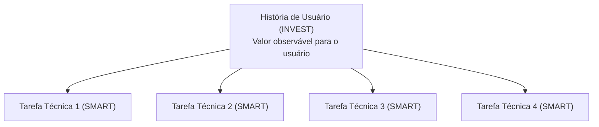
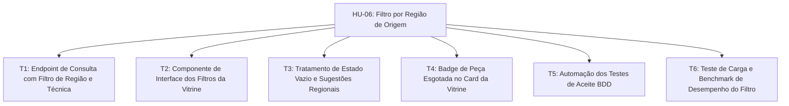
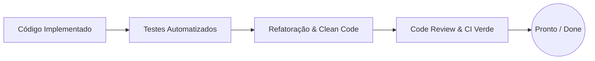

# ⏱️ 04. Tarefas SMART e Decomposição Técnica

### Projeto Integrador IV · Marketplace Origem
**Disciplina:** Requisitos, Projeto de Software e Validação (ADS020) · **Semestre:** 2026.2  
**Referência Metodológica:** Bill Wake (INVEST & SMART Tasks), Extreme Programming (XP)

---

## 1. Conceito: INVEST vs SMART

No ciclo de engenharia de software da disciplina, existe uma fronteira fundamental de granularidade:

> [!IMPORTANT]
> • **INVEST** avalia a qualidade de **Histórias de Usuário** (entregas verticais de valor ao usuário).  
> • **SMART** avalia a qualidade de **Tarefas Técnicas** (atividades de engenharia necessárias para realizar a história).

---

## 2. As 5 Dimensões SMART para Tarefas de Software

| Letra | Significado | Pergunta Guia da Engenharia | Condição de Validação |
| :--- | :--- | :--- | :--- |
| **S** | **Specific** *(Específica)* | O escopo do que está e não está incluído está claro para todos, sem sobreposição com outras tarefas? | A tarefa delimita exatamente qual camada ou componente será modificado. |
| **M** | **Measurable** *(Mensurável)* | Existe uma condição inequívoca para marcar a tarefa como pronta? | Considera-se concluída quando: **1)** funciona; **2)** inclui testes automatizados; **3)** o código foi refatorado. |
| **A** | **Achievable** *(Atingível)* | O responsável designado tem capacidade técnica de realizá-la ou sabe a quem recorrer? | A tarefa possui viabilidade técnica e dependências mapeadas. |
| **R** | **Relevant** *(Relevante)* | É possível justificar como esta tarefa técnica contribui diretamente para a História de Usuário? | Sem a tarefa, um ou mais critérios de aceite da HU ficariam incompletos. |
| **T** | **Time-boxed** *(Temporal)* | Há uma expectativa explícita de duração para sinalizar à equipe quando pedir ajuda? | Prazo expresso em horas ou dias úteis (ex: 4h, 1 dia, 2 dias). |

---

## 3. Decomposição Prática: HU-06 (Filtro por Região de Origem)

Partindo dos cinco critérios de aceite da **HU-06**, decompõe-se o trabalho nas tarefas técnicas abaixo:

### Análise Detalhada das Tarefas SMART da HU-06

#### T1: Consulta backend com suporte a filtros combinados
* **Enunciado:** *Implementar, em até 1 dia de trabalho, a consulta e endpoint backend que retorna as peças da região selecionada e permite combinação cumulativa com o filtro de técnica artesanal.*
* **S (Específica):** Focada estritamente na query SQL/ORM e no controller REST da API. Não mexe em layout.
* **M (Mensurável):** Concluída quando passa nos testes de unidade dos Cenários 1 e 3 e o código de acesso a dados está refatorado.
* **A (Atingível):** Responsabilidade do desenvolvedor backend, que alinha com a modelagem do banco de dados.
* **R (Relevante):** Essencial para fornecer os dados filtrados à vitrine.
* **T (Temporal):** Limite de **1 dia útil (8 horas)**.

#### T2: Interação e estado dos filtros na vitrine frontend
* **Enunciado:** *Implementar, em até 1 dia de trabalho, a interface visual de seleção e remoção de filtros na vitrine, mantendo badges visíveis para filtros ativos de região e técnica.*
* **S (Específica):** Cuida da captura do clique, atualização de parâmetros na URL e renderização dos cards.
* **M (Mensurável):** Concluída quando o usuário adiciona/remove filtros e a tela atualiza conforme os critérios de aceite.
* **A (Atingível):** Desenvolvedor frontend consumindo o contrato da API de T1.
* **R (Relevante):** Concretiza a interação do comprador com o catálogo.
* **T (Temporal):** Limite de **1 dia útil (8 horas)**.

#### T3: Tratamento de vitrine vazia para regiões sem peças
* **Enunciado:** *Implementar, em até 4 horas de trabalho, o componente de fallback na vitrine para exibir a mensagem informativa e lista de regiões ativas quando o filtro retornar zero resultados.*
* **S (Específica):** Focada exclusivamente no Cenário 2 (tratamento de estado vazio).
* **M (Mensurável):** Concluída quando a mensagem e a listagem de regiões vizinhas aparecem sem quebrar a navegação.
* **A (Atingível):** Simples extensão do componente de listagem no frontend.
* **R (Relevante):** Evita que o usuário encontre uma página em branco e desista do site.
* **T (Temporal):** Limite de **meio período (4 horas)**.

#### T4: Renderização de peças com estoque esgotado
* **Enunciado:** *Implementar, em até 4 horas de trabalho, a renderização da badge "Esgotado" e o bloqueio do botão de compra nos cards de produtos com quantidade igual a zero.*
* **S (Específica):** Limita-se ao comportamento visual e restrição de clique do Cenário 4.
* **M (Mensurável):** Concluída quando produtos com estoque zero não disparam evento de adição ao carrinho.
* **A (Atingível):** Frontend com apoio do schema de produto retornado pelo backend.
* **R (Relevante):** Evita inconsistência e frustração de compras impossíveis.
* **T (Temporal):** Limite de **meio período (4 horas)**.

#### T5: Automação dos testes de aceitação BDD
* **Enunciado:** *Automatizar, em até 2 dias de trabalho, os testes de integração ponta a ponta dos cenários de filtro por região, técnica e estados de erro.*
* **S (Específica):** Criação dos steps de teste executáveis em framework BDD (ex: Cypress/Playwright/Jest).
* **M (Mensurável):** Concluída quando todos os cenários rodam de forma automatizada e passam com sucesso na pipeline.
* **A (Atingível):** Equipe de qualidade/testes em cooperação com desenvolvedores.
* **R (Relevante):** Garante a não regressão funcional a cada novo deploy.
* **T (Temporal):** Limite de **2 dias úteis (16 horas)**.

#### T6: Verificação e benchmark de desempenho da consulta
* **Enunciado:** *Preparar massa de 10.000 peças sintéticas e verificar, em até 1 dia de trabalho, se a consulta filtrada por região responde em menos de 250ms no percentil 95.*
* **S (Específica):** Envolve carga de dados sintéticos e execução de teste de benchmark na query indexada.
* **M (Mensurável):** Concluída com a emissão do relatório de tempo de resposta da consulta com dados comprobatórios.
* **A (Atingível):** Integrante de banco de dados/backend.
* **R (Relevante):** Valida formalmente o cumprimento do Requisito Não Funcional RNF02.
* **T (Temporal):** Limite de **1 dia útil (8 horas)**.

---

## 4. Decomposição Prática: HU-14 (Checkout com Baixa Concorrente - FCCPD)

| ID | Tarefa Técnica SMART | Escopo e Responsabilidade | DoD (Critério de Pronto) | Timebox |
| :--- | :--- | :--- | :--- | :--- |
| **T-CHK-01** | Implementar a transação com *Lock Otimista* (ou *Pessimista com `SELECT FOR UPDATE`*) no banco de dados para débito atômico de estoque. | **Backend / BD:** Criação da query transacional com isolamento adequado para evitar *race conditions*. | Testes de integração concorrentes passando sem gerar estoque negativo. | 1 dia (8h) |
| **T-CHK-02** | Desenvolver teste de estresse de concorrência com 50 requisições simultâneas disputando 1 única peça. | **QA / FCCPD:** Script de simulação paralela de checkout para comprovar que exatamente 1 compra obtém sucesso. | Relatório de consistência e logs transacionais auditados. | 1 dia (8h) |
| **T-CHK-03** | Configurar fila assíncrona (RabbitMQ/Redis) para envio de notificações pós-venda após confirmação da transação. | **Backend / Distribuído:** Publicador de eventos na API e consumidor em worker desacoplado. | Evento publicado e consumido com sucesso sem bloquear a resposta HTTP do checkout. | 1 dia (8h) |

---

## 5. Decomposição Prática: Histórias Críticas da U1

### 🔐 HU-02: Autenticação e Controle de Acesso (RBAC)

| ID | Tarefa Técnica SMART | Escopo e Responsabilidade | DoD (Critério de Pronto) | Timebox |
| :--- | :--- | :--- | :--- | :--- |
| **T-AUTH-01** | Criar serviço de autenticação com hash de senha (bcrypt) e geração de token JWT assinado com refresh token. | **Backend:** Controller `/auth/login`, geração de claims (`role`, `userId`) e middleware de verificação de token. | Testes unitários com senhas válidas/inválidas e retorno de JWT verificado. | 1 dia (8h) |
| **T-AUTH-02** | Implementar guards e middlewares de autorização RBAC para proteção de rotas restritas (*Comprador*, *Artesão*, *Admin*). | **Backend:** Interceptadores de rota com validação de permissão e retorno de HTTP 401/403. | Tentativa de acesso a rota de outro papel bloqueada com teste automatizado. | 4 horas |
| **T-AUTH-03** | Desenvolver formulário de login com feedback de erro e persistência segura do token no cliente. | **Frontend:** Componente de formulário, validação de campos, armazenamento e redirecionamento pós-login. | Login funcional com feedback visual de validação e redirecionamento correto. | 6 horas |

### 🏺 HU-09: Publicação de Nova Peça pelo Artesão

| ID | Tarefa Técnica SMART | Escopo e Responsabilidade | DoD (Critério de Pronto) | Timebox |
| :--- | :--- | :--- | :--- | :--- |
| **T-PUB-01** | Desenvolver endpoint `POST /produtos` com validação de campos obrigatórios, vínculo de técnica/polo e isolamento por artesão. | **Backend:** Validação de payload (DTO), persistência no banco e vinculação com o usuário autenticado. | Teste de integração garantindo que apenas artesãos homologados criem peças. | 6 horas |
| **T-PUB-02** | Implementar upload e armazenamento de fotos da peça com validação de formato e tamanho máximo. | **Backend / Infra:** Serviço de upload de arquivos (local/bucket S3 simulado) e associação com a entidade `Midia`. | Upload de imagens JPG/PNG com vínculo à peça persistido com sucesso. | 6 horas |
| **T-PUB-03** | Construir formulário no painel do artesão com pré-visualização de imagens e seleção de polo e técnica regional. | **Frontend:** Interface com campos de dimensões, peso, técnica tradicional e galeria interativa de upload. | Formulário responsivo com preview de mídias e tratamento de erros de validação. | 1 dia (8h) |

### 🤖 HU-24: Baseline do Módulo de Recomendação (Engenharia de Software & IA)

| ID | Tarefa Técnica SMART | Escopo e Responsabilidade | DoD (Critério de Pronto) | Timebox |
| :--- | :--- | :--- | :--- | :--- |
| **T-IA-01** | Mapear e extrair features de produtos do banco de dados (técnica, polo de origem, categoria e preço) em formato tabular. | **IA / BD:** Pipeline/query de extração de dados estruturados para alimentar o serviço de recomendação. | Dataset estruturado gerado e validado com dados sintéticos do banco. | 4 horas |
| **T-IA-02** | Implementar baseline funcional de recomendação baseado em similaridade de conteúdo (técnica + polo regional). | **IA / Backend:** Algoritmo heurístico de ranking e endpoint `/produtos/{id}/recomendados`. | Endpoint retornando top-N peças afins com teste unitário validando coerência. | 1 dia (8h) |
| **T-IA-03** | Integrar o componente de recomendações na página de detalhes da peça na vitrine web. | **Frontend:** Seção "Você também pode gostar" consumindo o endpoint de recomendação. | Cards de peças recomendadas renderizados com links diretos na vitrine. | 4 horas |

---

## 6. Definição de Pronto (Definition of Done - DoD)

Uma tarefa técnica é formalmente considerada **CONCLUÍDA** quando satisfaz integralmente os seguintes critérios de engenharia:

1. **Funcionalidade Verificada:** Atende estritamente ao escopo da tarefa e aos critérios de aceite da história associada.
2. **Cobertura de Testes:** Acompanhada de testes automatizados (unitários ou integração) cobrindo caminhos felizes e casos de borda.
3. **Qualidade de Código (Refatoração):** Código limpo sem duplicações, aderente aos princípios SOLID/GRASP e sem avisos de linter.
4. **Integração Contínua (CI):** Branch integrada com a branch principal sem quebrar a suíte de testes existente.

