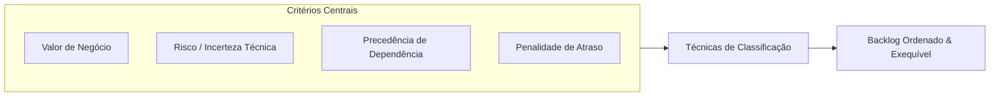
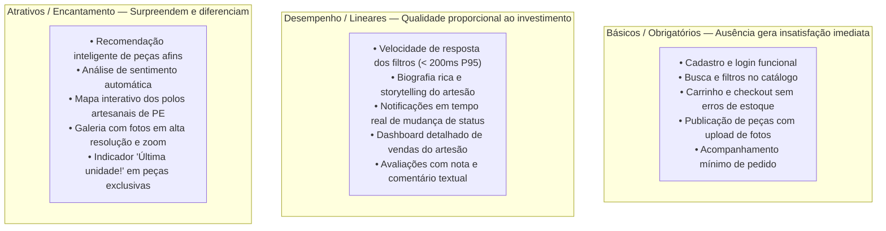
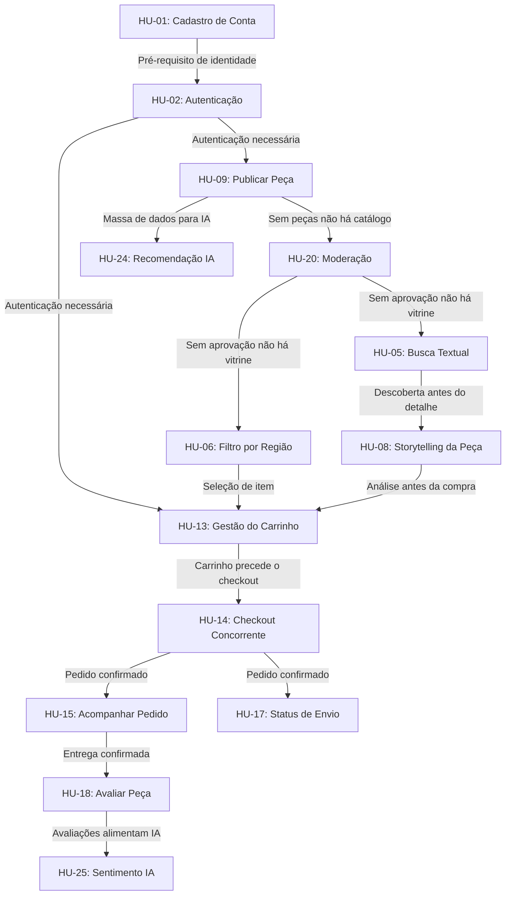

# ⚖️ 05. Priorização de Requisitos

### Projeto Integrador IV · Marketplace Origem
**Disciplina:** Requisitos, Projeto de Software e Validação (ADS020) · **Semestre:** 2026.2  
**Referência Metodológica:** Leffingwell & Widrig, DSDM Agile Project Framework (MoSCoW), Mike Cohn, Noriaki Kano

---

## 1. Por que Priorizar Requisitos?

Tempo, capacidade técnica da equipe e prazos semestrais são finitos. Priorizar é o ato de tomar **decisões conscientes, transparentes e registradas** sobre o que deve ser construído primeiro, orientando o esforço para o que gera maior valor e mitiga maiores riscos.



---

## 2. Técnica 1: MoSCoW (Recorte de Escopo por Unidade)

A técnica MoSCoW classifica as 25 Histórias de Usuário quanto à sua essencialidade para as entregas de **U1 (AV1)** e **U2 (AV2)**:

| Categoria | Definição | Histórias Alocadas | Justificativa |
| :--- | :--- | :--- | :--- |
| **Must Have** *(Indispensável — U1)* | Sem eles a entrega não faz sentido; constitui o núcleo mínimo funcional. | • **HU-01:** Cadastro de Conta<br>• **HU-02:** Autenticação<br>• **HU-05:** Busca Textual<br>• **HU-06:** Filtro por Região<br>• **HU-09:** Publicação de Peça<br>• **HU-11:** Gestão de Estoque<br>• **HU-13:** Gestão do Carrinho<br>• **HU-14:** Checkout Concorrente<br>• **HU-20:** Moderação de Publicações | Sem identidade, catálogo, carrinho e checkout, não há aplicação funcional. A moderação é obrigatória para o fluxo de publicação. |
| **Should Have** *(Importante — U1/U2)* | Altamente relevante; o sistema opera com contornos temporários caso atrase. | • **HU-03:** Recuperação de Senha<br>• **HU-04:** Gestão de Perfil/Endereços<br>• **HU-07:** Filtro por Técnica<br>• **HU-08:** Storytelling da Peça<br>• **HU-10:** Edição de Peça<br>• **HU-12:** Painel de Vendas do Artesão<br>• **HU-15:** Acompanhamento de Pedido<br>• **HU-17:** Status de Envio pelo Artesão<br>• **HU-18:** Avaliação de Peça<br>• **HU-21:** Homologação de Artesão | Funcionalidades que completam o ciclo de vida do pedido e enriquecem a experiência, mas admitem entrega em fases (início de U1 até início de U2). |
| **Could Have** *(Desejável — U2)* | Recursos de encanto e diferenciação que podem ser postergados sem prejuízo ao núcleo. | • **HU-16:** Cancelamento de Pedido com estorno<br>• **HU-19:** Histórico de Compras<br>• **HU-22:** Dashboard de Indicadores<br>• **HU-23:** Logs de Auditoria<br>• **HU-24:** Recomendação Contextual (IA)<br>• **HU-25:** Análise de Sentimento (IA) | Módulos de inteligência, analytics e auditoria que elevam a maturidade mas não bloqueiam o fluxo principal de compra. |
| **Won't Have this time** *(Fora de Escopo)* | Itens explicitamente excluídos nesta versão. | • Integração com gateways de pagamento reais (Pagar.me, Stripe)<br>• Cálculo dinâmico de frete via Correios/transportadoras<br>• Chat em tempo real entre comprador e artesão<br>• Emissão fiscal de NF-e<br>• App mobile nativo (iOS/Android)<br>• Programa de fidelidade/pontos | Evita complexidade desnecessária ao contexto acadêmico; pagamento e frete são **simulados** por diretriz do PI IV. |

---

## 3. Técnica 2: Matriz Valor × Risco (Incerteza Técnica)

Avalia as funcionalidades sob duas dimensões: o **valor para o ecossistema cultural** e o **risco/incerteza técnica** da implementação:

```mermaid
quadrantChart
    title Matriz Valor x Risco (Incerteza Técnica)
    x-axis Baixo Risco (Conhecido) --> Alto Risco (Incerteza/Complexo)
    y-axis Baixo Valor --> Alto Valor
    quadrant-1 Alto Valor / Alto Risco (Investigar Cedo - Spike U1)
    quadrant-2 Alto Valor / Baixo Risco (Base Confiável - Primeiras Sprints)
    quadrant-3 Baixo Valor / Baixo Risco (Preenchimento - Sprints Finais)
    quadrant-4 Baixo Valor / Alto Risco (Candidatos a Eliminação)
    "HU-14: Checkout Concorrente": [0.85, 0.95]
    "HU-25: Análise Sentimento NLP": [0.80, 0.55]
    "HU-24: Recomendação IA": [0.72, 0.65]
    "HU-01: Cadastro + HU-02: Login": [0.20, 0.90]
    "HU-06: Filtro por Região": [0.25, 0.88]
    "HU-09: Publicação de Peça": [0.30, 0.85]
    "HU-13: Carrinho": [0.32, 0.82]
    "HU-08: Storytelling": [0.22, 0.78]
    "HU-15: Acompanhar Pedido": [0.28, 0.72]
    "HU-18: Avaliação": [0.25, 0.68]
    "HU-22: Dashboard Admin": [0.45, 0.60]
    "HU-19: Histórico Compras": [0.18, 0.40]
    "HU-23: Logs Auditoria": [0.38, 0.45]
```

### Estratégia Derivada da Matriz:
* **Spike Técnico Imediato (Alto Risco / Alto Valor):** A **HU-14 (Checkout Concorrente)** é prototipada no início da U1 como *Spike* técnico, pois envolve concorrência transacional e é a maior incerteza do projeto.
* **Base Confiável (Alto Valor / Baixo Risco):** Cadastro, Login, Vitrine, Filtros e Publicação são entregues nas primeiras sprints — tecnologicamente conhecidos e de alto valor funcional.
* **Investigação Proativa:** Módulos de IA (HU-24 e HU-25) recebem um spike de viabilidade na U1 para definição de features e baseline, com integração completa na U2.

---

## 4. Técnica 3: Modelo Kano (Satisfação do Usuário)

Classifica como cada requisito impacta a percepção de qualidade do comprador e do artesão:



---

## 5. Técnica 4: Priorização por Dependência (Precedência Lógica)

> **Regra de Exequibilidade:** *Um requisito só pode ser implementado e testado de forma consistente se os requisitos dos quais ele depende já estiverem estabelecidos.*



### Tabela de Rastreabilidade de Dependências:

| História de Usuário | Depende de | É Pré-requisito para | Justificativa |
| :--- | :--- | :--- | :--- |
| **HU-01: Cadastro** | Nenhuma | HU-02 | Sem identidade criada, não há login possível. |
| **HU-02: Autenticação** | HU-01 | HU-09, HU-13 | Publicação e carrinho exigem sessão autenticada. |
| **HU-09: Publicar Peça** | HU-02 | HU-20 | Peça submetida precisa ser moderada antes de ser visível. |
| **HU-20: Moderação** | HU-09 | HU-05, HU-06 | Sem peças aprovadas, a vitrine fica vazia. |
| **HU-05/06: Busca e Filtros** | HU-20 | HU-08, HU-13 | Comprador precisa encontrar a peça antes de ver detalhes ou adicionar ao carrinho. |
| **HU-08: Storytelling** | HU-05/06 | HU-13 | Detalhes da peça informam a decisão de compra. |
| **HU-13: Carrinho** | HU-02, HU-05/06/08 | HU-14 | Itens são compostos no carrinho antes do checkout. |
| **HU-14: Checkout** | HU-13 | HU-15, HU-17 | Somente pedidos confirmados são acompanháveis. |
| **HU-15: Acompanhar Pedido** | HU-14 | HU-18 | Comprador avalia após entrega confirmada. |
| **HU-17: Status de Envio** | HU-14 | HU-15 (indiretamente) | Artesão atualiza, comprador visualiza. |
| **HU-18: Avaliar Peça** | HU-15 | HU-25 | Avaliações alimentam a análise de sentimento. |
| **HU-24: Recomendação IA** | HU-09 (massa de dados) | Nenhuma | Requer catálogo com peças suficientes. |
| **HU-25: Sentimento IA** | HU-18 | Nenhuma | Requer avaliações textuais cadastradas. |

---

## 6. Registro de Evidências da Priorização

Conforme as boas práticas da disciplina (ADS020), as decisões de prioridade foram registradas com base nos seguintes critérios ponderados:

| Critério | Peso | Descrição |
| :--- | :--- | :--- |
| **Valor cultural para artesãos e compradores** | 40% | A história contribui diretamente para a proposta de valor do Origem (visibilidade, autenticidade, conexão direta). |
| **Viabilidade técnica no prazo semestral** | 25% | A equipe possui as competências necessárias e o prazo é realista. |
| **Aderência às rubricas das 5 disciplinas** | 20% | A história gera entregáveis avaliáveis nas disciplinas de Web, BD, Requisitos, FCCPD e IA. |
| **Precedência de dependência lógica** | 15% | A história libera (ou bloqueia) o trabalho de outras histórias no backlog. |

**Revisão contínua:** A ordem do backlog será reavaliada nos checkpoints quinzenais entre U1 e U2, com base no velocity real da equipe e nos feedbacks recebidos.
