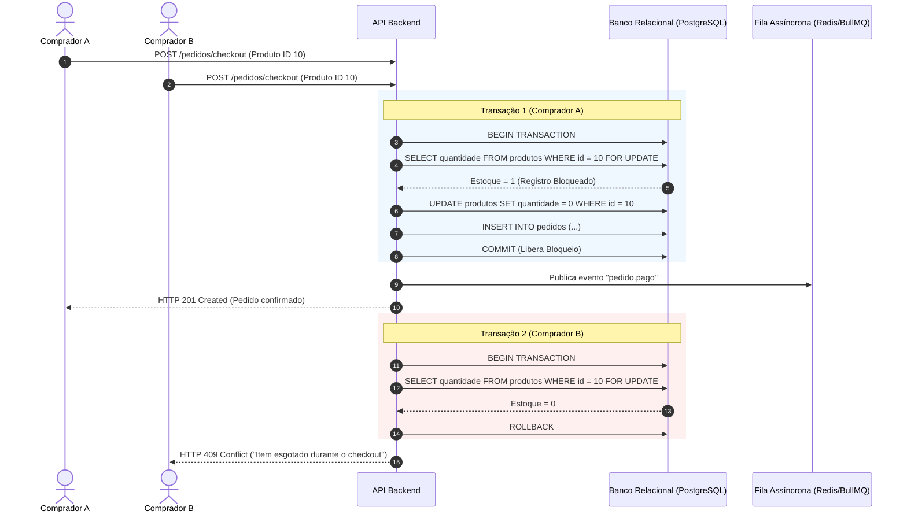
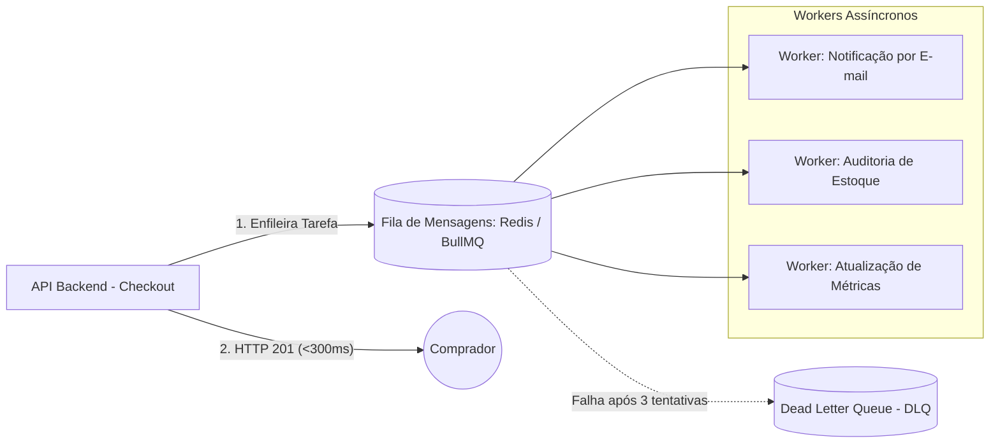
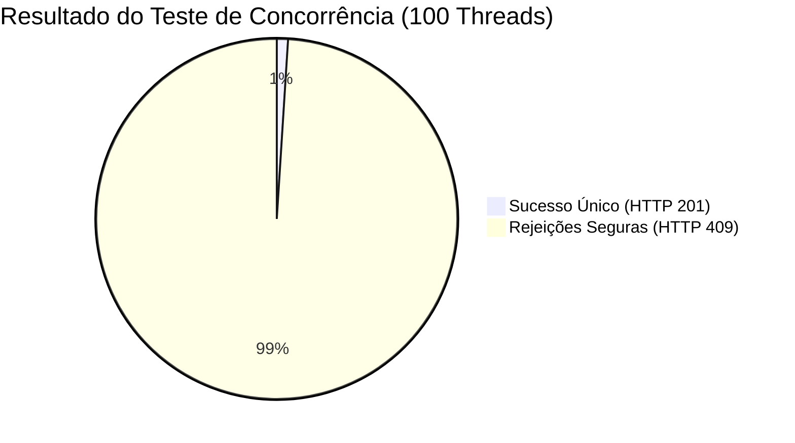

# ⚡ 07. Arquitetura de Concorrência e Mensageria (FCCPD)

### Projeto Integrador IV · Marketplace Origem
**Disciplina:** Fundamentos de Computação Concorrente, Paralela e Distribuída (FCCPD) · **Semestre:** 2026.2  
**Foco da Unidade 1:** Concorrência no Checkout/Estoque, Fila Assíncrona e Evidência de Consistência

---

## 1. Concorrência Crítica no Checkout e Baixa de Estoque (Peso: 45%)

### O Problema de Concorrência
Peças artesanais exclusivas possuem estoque unitário restrito (`quantidade = 1`). Requisições concorrentes quase simultâneas de compra da mesma peça podem gerar *Race Condition* e *Overselling* (venda dupla).

### Mecanismo de Controle Transacional (ACID)
Adota-se **Lock Pessimista (`SELECT ... FOR UPDATE`)** no banco de dados relacional sob nível de isolamento `READ COMMITTED`:



#### Alternativa Suportada (Lock Otimista):
```sql
UPDATE produtos 
SET quantidade = quantidade - :qtd, versao = versao + 1 
WHERE id = :id AND versao = :versao_lida AND quantidade >= :qtd;
-- Se linhas_afetadas == 0 -> Dispara Rollback e HTTP 409
```

---

## 2. Arquitetura de Fila Assíncrona e Desacoplamento (Peso: 35%)

Tarefas secundárias e não bloqueantes são delegadas a uma **Fila Assíncrona (Redis + BullMQ ou RabbitMQ)**, garantindo que o tempo de resposta da API permaneça $\le 300\text{ ms}$ (RNF-03 e RNF-05).



### Especificação do Evento da Fila

| Campo | Tipo | Descrição |
| :--- | :--- | :--- |
| **evento** | `String` | `"pedido.pago"` |
| **pedidoId** | `UUID` | Identificador único do pedido confirmado |
| **compradorEmail** | `String` | E-mail do destinatário para envio do comprovante |
| **artesaoId** | `UUID` | Identificador do artesão para notificação de nova venda |
| **itens** | `Array` | Lista de itens adquiridos com quantidade e valor |
| **timestamp** | `DateTime` | Data e hora exata da emissão da mensagem |

### Política de Tolerância a Falhas e Resiliência:
* **Tentativas:** Até **3 retentativas automáticas** com recuo exponencial (*exponential backoff* de 2s, 4s e 8s).
* **Dead Letter Queue (DLQ):** Mensagens que excederem as 3 tentativas são transferidas para `pedidos-dlq` para análise e alerta de monitoramento sem perda de dados.

---

## 3. Protocolo de Teste de Estresse e Evidência de Consistência (Peso: 20%)

Para comprovação formal da integridade transacional na entrega da U1:

### Cenário de Teste Automatizado
* **Condição Inicial:** Produto $X$ cadastrado com `quantidade = 1`.
* **Carga Simultânea:** Disparo concorrente de **100 threads/requisições** tentando realizar o checkout do mesmo Produto $X$ simultaneamente.
* **Resultado Esperado (Critério de Aprovação):**
  * **Exatamente 1 requisição** com status `HTTP 201 Created`.
  * **Exatamente 99 requisições** com status `HTTP 409 Conflict`.
  * Saldo final de estoque no banco de dados **exatamente igual a 0** (zero overselling e zero saldo negativo).
  * Exatamente 1 registro gerado em `pedidos` e 1 mensagem publicada na fila assíncrona.


