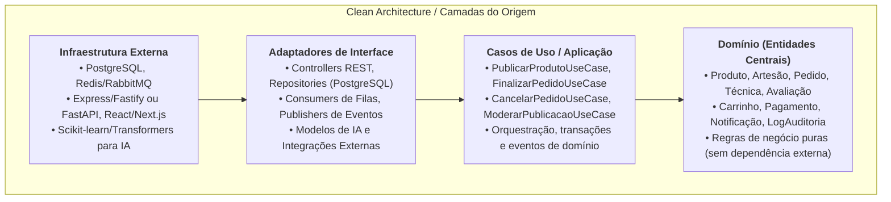
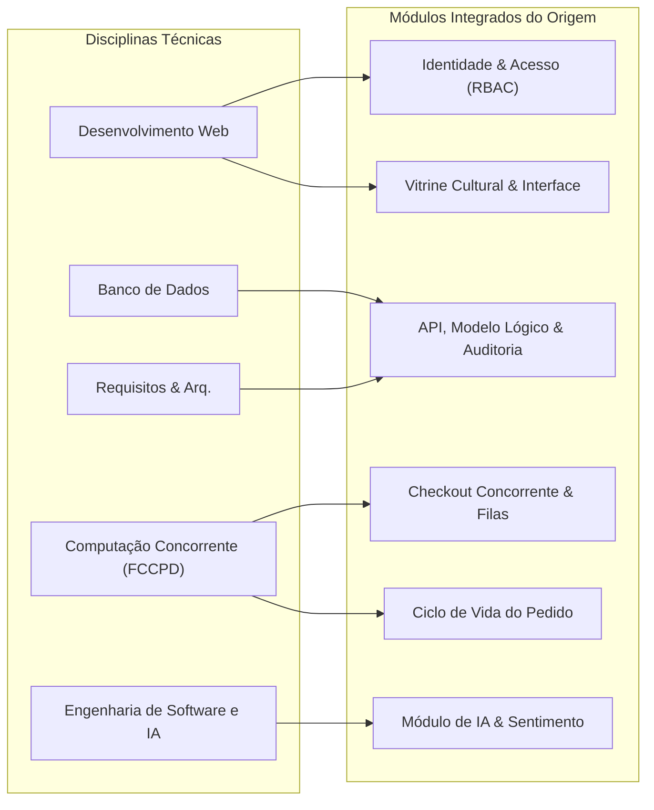
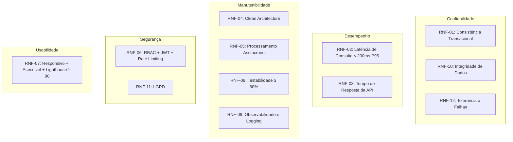

# ⚙️ 06. Requisitos Não Funcionais e Princípios Arquiteturais

### Projeto Integrador IV · Marketplace Origem
**Disciplina:** Requisitos, Projeto de Software e Validação (ADS020) · **Semestre:** 2026.2  
**Referência Metodológica:** Pressman, Robert C. Martin (SOLID/Clean Architecture), Larman (GRASP), ISO/IEC 25010 (SQuaRE), ISO/IEC/IEEE 29148:2018

---

## 1. Requisitos Não Funcionais (RNF) — Especificação Completa

Os RNFs são organizados conforme as dimensões de qualidade da norma **ISO/IEC 25010**, cada um com descrição formal, métrica mensurável objetiva e método de verificação.

---

### 🔒 RNF-01: Consistência Transacional e Concorrência (Confiabilidade)

| Aspecto | Especificação |
| :--- | :--- |
| **Descrição** | Todas as operações de reserva e baixa de estoque no checkout devem ser atômicas, consistentes, isoladas e duráveis (ACID). O sistema deve impedir race conditions, overselling e saldo de estoque negativo sob qualquer carga de concorrência simultânea. |
| **Métrica** | Execução de teste de estresse automatizado com **100 threads simultâneas** disputando 1 única peça com estoque = 1. Resultado obrigatório: **exatamente 1 sucesso e 99 rejeições seguras**, estoque final = 0 e zero registros inconsistentes. |
| **Mecanismo Técnico** | Lock otimista com versionamento (coluna `versao` na entidade `Produto`) ou lock pessimista com `SELECT ... FOR UPDATE` no banco relacional. Nível de isolamento mínimo: `READ COMMITTED`. |
| **Verificação** | Script de estresse com relatório de execução salvo em artefato de teste. |
| **Disciplina** | *FCCPD & Banco de Dados* |

---

### ⚡ RNF-02: Desempenho e Latência de Consulta (Eficiência de Desempenho)

| Aspecto | Especificação |
| :--- | :--- |
| **Descrição** | As consultas de busca textual combinadas com filtros de região, técnica e faixa de preço devem responder dentro de limites de latência estritos, mesmo com crescimento significativo da base de dados. |
| **Métrica** | Latência de resposta ≤ **200 ms no P95** e ≤ **500 ms no P99** para uma base de **10.000 peças** com **50 requisições concorrentes**. |
| **Mecanismo Técnico** | Índices compostos B-Tree sobre `(tecnica_id, artesao_polo_origem)`, índice GIN/trgm para busca textual com `pg_trgm`, paginação por cursor (keyset) ao invés de OFFSET. |
| **Verificação** | Benchmark com ferramenta de carga (ex: k6, Artillery) e relatório de latência P50/P95/P99 com plano de execução SQL (`EXPLAIN ANALYZE`). |
| **Disciplina** | *Banco de Dados & Desenvolvimento Web* |

---

### ⏱️ RNF-03: Tempo de Resposta da API (Eficiência de Desempenho)

| Aspecto | Especificação |
| :--- | :--- |
| **Descrição** | As operações da API REST devem responder dentro de limites de tempo que garantam uma experiência fluida ao usuário. |
| **Métrica** | • Endpoints de leitura (GET): ≤ **300 ms** no P95. • Endpoints de escrita simples (POST/PUT): ≤ **500 ms** no P95. • Endpoint de checkout/finalização de pedido: ≤ **800 ms** no P95 (inclui transação de estoque + processamento de pagamento simulado). • Resposta do checkout ao cliente NÃO deve aguardar processamento de fila assíncrona. |
| **Verificação** | Suíte de testes de carga automatizada com relatório de percentis. |
| **Disciplina** | *Desenvolvimento Web & FCCPD* |

---

### 🏗️ RNF-04: Arquitetura em Camadas e Desacoplamento (Manutenibilidade)

| Aspecto | Especificação |
| :--- | :--- |
| **Descrição** | O sistema backend deve adotar a arquitetura **Clean Architecture / Hexagonal** com separação estrita de camadas: Domínio (entidades e regras de negócio), Aplicação (casos de uso), Adaptadores (controllers, repositories) e Infraestrutura (frameworks, drivers, BD). |
| **Métrica** | As entidades de domínio (`Produto`, `Pedido`, `Artesao`, etc.) **não devem conter imports** de anotações de framework, ORM ou HTTP. Verificável por análise estática (linter de imports) ou revisão de código. |
| **Regras de Dependência** | • Domínio não depende de nenhuma camada externa. • Casos de uso dependem apenas de interfaces abstratas (ports). • Adaptadores implementam as interfaces definidas pelos casos de uso. • Infraestrutura é plugável e substituível sem alteração de lógica de negócio. |
| **Verificação** | Teste automatizado de conformidade arquitetural (ArchUnit, eslint-plugin-import, ou equivalente) garantindo que não existam dependências proibidas entre camadas. |
| **Disciplina** | *Requisitos e Projeto de Software* |

---

### 📨 RNF-05: Processamento Assíncrono e Escalabilidade (Eficiência / Manutenibilidade)

| Aspecto | Especificação |
| :--- | :--- |
| **Descrição** | Tarefas pesadas ou desacopladas (envio de notificações, geração de comprovantes, cálculo de métricas, enriquecimento por IA e análise de sentimento) devem ser executadas em workers assíncronos via fila de mensagens, sem bloquear a resposta HTTP principal. |
| **Métrica** | • A resposta HTTP do checkout deve ser entregue ao cliente **sem aguardar** a conclusão dos workers. • Taxa de processamento da fila: capacidade de processar ≥ **100 mensagens/minuto** em condições normais. • Mensagens falhadas devem ser retentadas até **3 vezes** antes de serem movidas para Dead Letter Queue (DLQ). |
| **Mecanismo Técnico** | Fila de mensagens (RabbitMQ, Redis Queue ou BullMQ) com padrão publish-subscribe, workers independentes e monitoramento de DLQ. |
| **Verificação** | Teste de integração que confirma a publicação da mensagem na fila, consumo pelo worker e persistência do resultado (ex: notificação enviada, comprovante gerado). |
| **Disciplina** | *FCCPD & IA* |

---

### 🔐 RNF-06: Segurança, Autenticação e Controle de Acesso — RBAC (Segurança)

| Aspecto | Especificação |
| :--- | :--- |
| **Descrição** | O sistema deve implementar autenticação segura e autorização baseada em papéis (Role-Based Access Control) com 3 perfis estritos: **Comprador**, **Artesão** e **Administrador**. |
| **Requisitos Detalhados** | • Autenticação stateless via **JWT** com expiração configurável (padrão: 24h) e refresh token. • Senhas armazenadas com hash bcrypt (custo ≥ 10). • **Isolamento de dados por proprietário:** artesão só pode editar/gerenciar estoque de **suas próprias peças**; comprador só acessa **seus próprios pedidos**. Tentativa de acesso cruzado deve retornar **HTTP 403 Forbidden**. • Bloqueio temporário de conta após **5 tentativas** consecutivas de login incorretas (lockout de 15 minutos). • Proteção contra **SQL Injection** (queries parametrizadas), **XSS** (sanitização de output e Content-Security-Policy), **CSRF** (token anti-CSRF ou SameSite cookies). • Rate limiting na API: máximo de **100 requisições/minuto** por IP em endpoints públicos e **30 req/min** em endpoints sensíveis (login, recuperação de senha). |
| **Verificação** | • Testes automatizados de controle de acesso (RBAC) com cenários de acesso cruzado. • Testes de penetração básicos (OWASP ZAP ou equivalente) com relatório de vulnerabilidades. |
| **Disciplina** | *Desenvolvimento Web & Segurança* |

---

### 📱 RNF-07: Responsividade, Acessibilidade e Usabilidade (Usabilidade)

| Aspecto | Especificação |
| :--- | :--- |
| **Descrição** | A interface web deve ser totalmente responsiva (mobile-first), acessível e semanticamente estruturada, proporcionando experiência de qualidade em qualquer dispositivo. |
| **Requisitos Detalhados** | • Layout fluido e funcional em **3 breakpoints mínimos**: mobile (< 640px), tablet (640–1024px) e desktop (> 1024px). • Navegação e interação devem ser **completamente funcionais via teclado**. • Imagens devem possuir atributo `alt` descritivo (obrigatório no upload do artesão). • Contraste mínimo de **4.5:1** para texto normal e **3:1** para texto grande (WCAG 2.1 AA). • Uso de semântica HTML5 (header, nav, main, section, article, footer) e atributos WAI-ARIA quando necessário. • Tempo de carregamento do First Contentful Paint (FCP) ≤ **1.8 segundos** em conexões 4G simuladas. |
| **Métrica** | Google Lighthouse com pontuação ≥ **90** em Performance, ≥ **90** em Acessibilidade e ≥ **90** em Boas Práticas. |
| **Verificação** | Relatório de auditoria Lighthouse executado sobre as 5 páginas principais (home/vitrine, detalhes da peça, carrinho, perfil do artesão e checkout). |
| **Disciplina** | *Desenvolvimento Web* |

---

### 🧪 RNF-08: Testabilidade e Cobertura de Código (Manutenibilidade)

| Aspecto | Especificação |
| :--- | :--- |
| **Descrição** | O sistema deve ser projetado para testabilidade desde a concepção, com cobertura automatizada que garanta a integridade das regras de negócio e a não-regressão funcional. |
| **Requisitos Detalhados** | • **Testes unitários:** Cobertura mínima de **80%** (line coverage) sobre as classes de domínio e casos de uso. • **Testes de integração:** Cobertura dos endpoints críticos da API (cadastro, login, checkout, moderação, estoque) com verificação de contratos de entrada/saída. • **Testes de concorrência:** Suíte dedicada que simula disputas concorrentes por estoque (FCCPD). • **Testes E2E:** Automação dos cenários BDD críticos (checkout, filtro, avaliação) com Cypress, Playwright ou equivalente. • **Pipeline de CI:** Todos os testes devem executar automaticamente em cada push para a branch principal, bloqueando merge em caso de falha. |
| **Verificação** | Relatório de cobertura de código (Istanbul/c8, JaCoCo ou equivalente) publicado como artefato do CI. |
| **Disciplina** | *Requisitos e Validação* |

---

### 📊 RNF-09: Observabilidade, Logging e Monitoramento (Confiabilidade / Manutenibilidade)

| Aspecto | Especificação |
| :--- | :--- |
| **Descrição** | O sistema deve produzir logs estruturados e rastreáveis para toda operação sensível, permitindo diagnóstico de incidentes, auditoria de ações e monitoramento de saúde da aplicação. |
| **Requisitos Detalhados** | • **Logs estruturados** em formato JSON com campos: `timestamp`, `level`, `message`, `userId`, `action`, `entity`, `traceId`. • **Níveis de log:** `ERROR` para falhas, `WARN` para situações inesperadas, `INFO` para operações relevantes (login, checkout, moderação), `DEBUG` desabilitado em produção. • **Auditoria formal:** Toda ação de escrita sensível (alteração de estoque, moderação, cancelamento, alteração de preço) deve gerar um registro na tabela `LogAuditoria` com dados de antes e depois. • **Health check endpoint:** O sistema deve expor um endpoint `/health` que retorne status do banco de dados, fila de mensagens e serviços dependentes. |
| **Verificação** | Inspeção da saída de logs da aplicação em cenários de teste; verificação de presença dos campos obrigatórios; teste do endpoint `/health`. |
| **Disciplina** | *Desenvolvimento Web & FCCPD* |

---

### 🗄️ RNF-10: Integridade e Disponibilidade de Dados (Confiabilidade)

| Aspecto | Especificação |
| :--- | :--- |
| **Descrição** | O sistema deve garantir a integridade referencial e a disponibilidade dos dados persistidos, com mecanismos de proteção contra perda de informações. |
| **Requisitos Detalhados** | • **Integridade referencial:** Todas as foreign keys devem possuir constraint no banco de dados. Deleções em cascata devem ser explicitamente configuradas e documentadas (soft delete preferível para entidades de domínio como `Pedido` e `Avaliacao`). • **Backup:** Política de backup automatizado diário do banco de dados com retenção mínima de 7 dias. • **Migrações versionadas:** Toda alteração de schema deve ser feita via migrations numeradas e versionadas (ex: Flyway, Prisma Migrate, Knex) rastreáveis no controle de versão. • **Soft delete:** Registros de `Pedido`, `Avaliacao`, `Usuario` e `Produto` não devem ser fisicamente excluídos, mas marcados com flag `deletedAt` para preservação de histórico. |
| **Verificação** | Execução de restore a partir de backup; verificação de constraints via queries de validação; teste de migration up/down. |
| **Disciplina** | *Banco de Dados* |

---

### 🛡️ RNF-11: Proteção de Dados Pessoais — LGPD (Segurança / Conformidade Legal)

| Aspecto | Especificação |
| :--- | :--- |
| **Descrição** | O sistema deve tratar dados pessoais em conformidade com a Lei Geral de Proteção de Dados (Lei nº 13.709/2018 — LGPD), respeitando os princípios de finalidade, necessidade e transparência. |
| **Requisitos Detalhados** | • **Termo de consentimento:** No cadastro, o usuário deve aceitar explicitamente os termos de uso e a política de privacidade antes de prosseguir. • **Minimização de dados:** Coletar apenas os dados estritamente necessários para o funcionamento do sistema (nome, e-mail, telefone, endereço, CPF para comprador; dados artesanais para artesão). • **Direito de exclusão:** O usuário deve poder solicitar a exclusão definitiva de seus dados pessoais (anonimização de registros históricos vinculados a pedidos). • **Dados sensíveis:** CPF, e-mail e endereço completo não devem ser expostos em logs, respostas de API para terceiros ou endpoints públicos. |
| **Verificação** | Checklist de conformidade LGPD revisado pela equipe; teste de endpoints públicos para verificar que dados pessoais não estão expostos. |
| **Disciplina** | *Desenvolvimento Web & Requisitos* |

---

### 📦 RNF-12: Disponibilidade e Tolerância a Falhas (Confiabilidade)

| Aspecto | Especificação |
| :--- | :--- |
| **Descrição** | O sistema deve ser resiliente a falhas pontuais de componentes externos (banco de dados, fila de mensagens) sem comprometer integralmente a experiência do usuário. |
| **Requisitos Detalhados** | • **Graceful degradation:** Se a fila de mensagens estiver indisponível, o checkout deve continuar funcionando (notificações são enfileiradas localmente para retry posterior). • **Circuit breaker:** Chamadas ao serviço de pagamento simulado devem implementar circuit breaker para evitar cascata de falhas (timeout de 5s, abertura após 3 falhas consecutivas). • **Retry com backoff exponencial:** Workers de fila devem implementar retry com backoff (1s, 2s, 4s) antes de mover a mensagem para DLQ. • **Disponibilidade alvo:** ≥ **99%** de uptime mensal (excluindo janelas de manutenção programadas). |
| **Verificação** | Teste de falha simulada (desligar o serviço de fila e verificar que o checkout continua funcional); monitoramento de uptime em período de testes. |
| **Disciplina** | *FCCPD* |

---

## 2. Princípios de Software Aplicados (SOLID & GRASP)

O projeto do sistema **Origem** aplica rigorosamente os princípios fundamentais da Engenharia de Software:

### 2.1 Princípios SOLID no Origem:

| Princípio | Significado | Aplicação Concreta no Origem |
| :--- | :--- | :--- |
| **SRP** — Single Responsibility | Cada classe tem uma única razão para mudar. | `Produto` cuida apenas de estado e regras de estoque. `ProdutoRepository` cuida de persistência. `ProdutoController` cuida de serialização HTTP. `ProdutoPresenter` cuida de formatação para o frontend. |
| **OCP** — Open/Closed | Aberto para extensão, fechado para modificação. | O motor de recomendação implementa `IRecomendacaoStrategy`. Novas estratégias (content-based, collaborative filtering, híbrida) são adicionadas como novas classes sem alterar o código da vitrine ou do caso de uso existente. |
| **LSP** — Liskov Substitution | Subtipos devem ser substituíveis por seus tipos base. | `Artesao` e `Comprador` especializam `Usuario` sem quebrar o contrato base (`autenticar()`, `getIdentificacao()`). Qualquer código que receba `Usuario` funciona corretamente com ambas as subclasses. |
| **ISP** — Interface Segregation | Interfaces pequenas e coesas por papel. | `IGestaoCatalogo` (publicar, editar, gerenciar estoque) para o artesão. `IConsultaVitrine` (buscar, filtrar) para visitantes. `IFinalizacaoPedido` para o checkout. `IModeracao` para o admin. Nenhum ator é forçado a depender de métodos que não utiliza. |
| **DIP** — Dependency Inversion | Módulos de alto nível não dependem de módulos de baixo nível. | `FinalizarPedidoUseCase` depende de `IProdutoRepository`, `IPagamentoService` e `IFilaNotificacao` (interfaces abstratas). As implementações concretas (`PostgresProdutoRepository`, `SimuladorPagamento`, `RabbitMQPublisher`) são injetadas em tempo de inicialização. |

### 2.2 Padrões GRASP e de Projeto:

| Padrão | Aplicação no Origem |
| :--- | :--- |
| **Information Expert** | `Pedido` calcula `valorTotal` somando os subtotais de seus `ItemPedido` compostos. `Produto` calcula `notaMedia()` a partir de suas `Avaliacao` associadas. |
| **Creator** | `Pedido` é o criador natural de `ItemPedido` (composição forte). `Carrinho` cria `ItemCarrinho`. |
| **Controller** | Cada bounded context possui um controller dedicado (`ProdutoController`, `PedidoController`, `AutenticacaoController`) que delega a lógica ao caso de uso correspondente. |
| **Low Coupling** | A comunicação entre o módulo de checkout e o módulo de notificações/IA ocorre exclusivamente via fila assíncrona de mensagens (eventos de domínio), sem acoplamento direto. |
| **High Cohesion** | Cada módulo (Catálogo, Pedidos, Identidade, IA) agrupa classes e regras com responsabilidades fortemente relacionadas entre si. |
| **Repository** | Abstração completa da camada de dados. Permite testes unitários com repositórios in-memory e troca de SGBD sem impacto na lógica de negócio. |
| **Strategy** | Motor de recomendação com estratégias intercambiáveis (`ContentBasedStrategy`, `CollaborativeFilteringStrategy`). |
| **Observer / Pub-Sub** | Eventos de domínio (`PedidoConfirmado`, `ProdutoPublicado`, `AvaliacaoRegistrada`) publicados na fila e consumidos por workers especializados. |

---

## 3. Matriz de Integração com as Disciplinas do 4º Semestre

| Disciplina | Papel Específico no Sistema Origem | Entregáveis na U1 e U2 |
| :--- | :--- | :--- |
| **Desenvolvimento Web** | Frontend responsivo (vitrine, busca, carrinho, checkout, perfis, painel admin) e API backend RESTful com RBAC. | **U1:** Frontend com filtros, cadastro/login, carrinho + API com autenticação JWT. **U2:** Full stack integrado, dashboard admin e testes E2E. |
| **Modelagem e Banco de Dados** | Modelo relacional (conceitual, lógico, físico), normalização, DDL, migrations versionadas, índices e política de backup. | **U1:** Modelo lógico normalizado, DDL e carga sintética (seed). **U2:** Modelo físico otimizado com índices compostos, views materializadas e relatório de benchmark. |
| **Requisitos e Validação** | Análise de domínio, modelagem conceitual UML, backlog de 25 HUs INVEST com 68 cenários BDD, suíte de testes e documentação de refatorações. | **U1:** Documentação de domínio, modelo conceitual e Histórias SMART. **U2:** Plano de testes executado, relatório de cobertura e walkthrough de refatorações. |
| **Computação Concorrente (FCCPD)** | Controle transacional atômico no checkout, fila assíncrona de eventos, workers paralelos, circuit breaker e tolerância a falhas. | **U1:** Lock otimista/pessimista no checkout e 1ª fila assíncrona funcional. **U2:** Arquitetura distribuída com workers paralelos, DLQ, circuit breaker e ganho de desempenho medido. |
| **Engenharia de Software e IA** | Sistema de recomendação por similaridade de conteúdo (baseline) e por comportamento (avançado), classificação automática de categorias e análise de sentimento de avaliações. | **U1:** Definição do problema, feature engineering e baseline funcional de recomendação. **U2:** Módulo de IA integrado com recomendação comportamental, análise de sentimento e métricas de avaliação (precision, recall). |

---

## 4. Visão Geral dos Requisitos Não Funcionais

| ID | Categoria (ISO 25010) | Resumo | Métrica-Chave |
| :--- | :--- | :--- | :--- |
| **RNF-01** | Confiabilidade | Transações atômicas de estoque | 100 threads, 1 sucesso, 0 inconsistência |
| **RNF-02** | Eficiência | Latência de busca/filtro | ≤ 200ms P95, base de 10k peças |
| **RNF-03** | Eficiência | Tempo de resposta geral da API | GET ≤ 300ms, POST ≤ 500ms, checkout ≤ 800ms |
| **RNF-04** | Manutenibilidade | Arquitetura em camadas | Zero imports de framework no domínio |
| **RNF-05** | Eficiência / Manutenib. | Filas assíncronas com DLQ | ≥ 100 msg/min, retry 3x, DLQ |
| **RNF-06** | Segurança | Autenticação, RBAC e proteções | JWT, bcrypt ≥ 10, lockout 5 tentativas, rate limit |
| **RNF-07** | Usabilidade | Responsividade e acessibilidade | Lighthouse ≥ 90 em 3 categorias |
| **RNF-08** | Manutenibilidade | Cobertura de testes | ≥ 80% line coverage no domínio |
| **RNF-09** | Manutenibilidade | Logging estruturado e auditoria | JSON com traceId, `/health` endpoint |
| **RNF-10** | Confiabilidade | Integridade de dados | FKs, soft delete, backup diário, migrations |
| **RNF-11** | Conformidade | LGPD e proteção de dados | Consentimento, minimização, exclusão |
| **RNF-12** | Confiabilidade | Tolerância a falhas | Circuit breaker, graceful degradation, ≥ 99% uptime |
