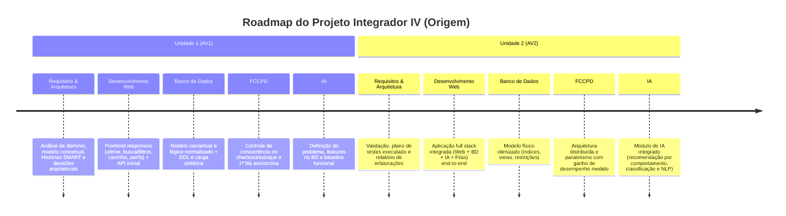

# 📚 Documentação Oficial — Projeto Origem
### Projeto Integrador IV · Análise e Desenvolvimento de Sistemas (2026.2)
**CESAR School · Disciplina: Requisitos, Projeto de Software e Validação (ADS020)**  
*Professora: Hayanna Silva Oliveira*

---

## 📌 Visão Geral do Repositório de Documentação

Este diretório reúne todos os artefatos de Engenharia de Software e Modelagem do projeto **Origem**, estruturados conforme as diretrizes acadêmicas e padrões formais de Engenharia de Requisitos (Pressman, Czarnecki & Eisenecker, Larman, Mike Cohn e Bill Wake).

```
docs/
├── README.md                                    # Sumário geral integrado
├── 01-requisitos-e-arquitetura/                 # Requisitos, Projeto de Software e Validação (ADS020)
│   ├── 01-analise-de-dominio.md
│   ├── 02-modelagem-conceitual.md
│   ├── 03-historias-de-usuario-e-bdd.md
│   ├── 04-tarefas-smart.md
│   ├── 05-priorizacao-de-requisitos.md
│   └── 06-requisitos-nao-funcionais-e-arquitetura.md
├── 02-banco-de-dados/                           # Modelagem e Projeto de Banco de Dados
├── 03-computacao-concorrente-distribuida/       # Fundamentos de Computação Concorrente, Paralela e Distribuída
│   └── 01-concorrencia-e-mensageria.md
├── 04-engenharia-software-e-ia/                 # Engenharia de Software e IA (Eletiva)
├── 05-desenvolvimento-web/                      # Desenvolvimento Web Full Stack
└── 06-projeto-integrador-iv/                    # Projeto 4 (Acompanhamento e Integração)
```

---

## 🧭 Sumário dos Documentos por Disciplina

### 🏛️ 1. Requisitos, Projeto de Software e Validação (ADS020)
* **[01. Análise de Domínio](./01-requisitos-e-arquitetura/01-analise-de-dominio.md):** Delimitação do domínio, as 4 informações-alvo (Atores, Processos, Restrições e Dores Reais), linguagem ubíqua e técnicas de obtenção de evidências.
* **[02. Modelagem Conceitual](./01-requisitos-e-arquitetura/02-modelagem-conceitual.md):** Diagrama de Casos de Uso UML, Diagrama de Classes Conceitual e Matriz de Coerência Bidirecional.
* **[03. Histórias de Usuário e BDD](./01-requisitos-e-arquitetura/03-historias-de-usuario-e-bdd.md):** 25 Histórias INVEST e critérios formais de aceite em Gherkin (`Dado / Quando / Então`).
* **[04. Tarefas SMART](./01-requisitos-e-arquitetura/04-tarefas-smart.md):** Decomposição técnica das histórias essenciais da U1 e Definição de Pronto (DoD).
* **[05. Priorização de Requisitos](./01-requisitos-e-arquitetura/05-priorizacao-de-requisitos.md):** Matriz MoSCoW (U1 vs U2), Matriz Valor $\times$ Risco, Modelo Kano e Grafo de Dependências.
* **[06. RNFs e Arquitetura](./01-requisitos-e-arquitetura/06-requisitos-nao-funcionais-e-arquitetura.md):** Requisitos Não Funcionais (ISO/IEC 25010), princípios SOLID e Clean Architecture.

### ⚡ 2. Computação Concorrente, Paralela e Distribuída (FCCPD)
* **[01. Concorrência e Mensageria](./03-computacao-concorrente-distribuida/01-concorrencia-e-mensageria.md):** Lock transacional no checkout/estoque, arquitetura de fila assíncrona (Redis/BullMQ) e protocolo de teste de consistência.

### 📂 3. Demais Pastas de Disciplinas
* **`02-banco-de-dados/`:** Estrutura reservada para DER, Modelo Lógico, DDL e carga sintética.
* **`04-engenharia-software-e-ia/`:** Estrutura reservada para especificação de IA, baseline e features.
* **`05-desenvolvimento-web/`:** Estrutura reservada para contratos de API REST e especificações frontend.
* **`06-projeto-integrador-iv/`:** Estrutura reservada para atas de integração, matriz de riscos e checkpoints.

---

## 🎯 Alinhamento com as Entregas do PI IV


