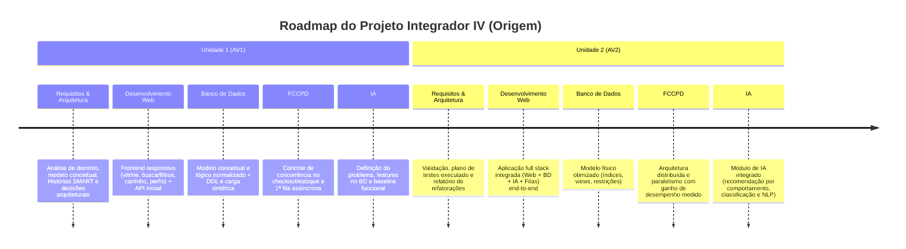

# 📚 Documentação Oficial — Projeto Origem
### Projeto Integrador IV · Análise e Desenvolvimento de Sistemas (2026.2)
**CESAR School · Disciplina: Requisitos, Projeto de Software e Validação (ADS020)**  
*Professora: Hayanna Silva Oliveira*

---

## 📌 Visão Geral do Repositório de Documentação

Este diretório reúne todos os artefatos de Engenharia de Software e Modelagem do projeto **Origem**, estruturados conforme as diretrizes acadêmicas e padrões formais de Engenharia de Requisitos (Pressman, Czarnecki & Eisenecker, Larman, Mike Cohn e Bill Wake).

```
docs/
├── README.md                                    # Este sumário geral
├── 01-analise-de-dominio.md                     # Delimitação, 4 informações-alvo e linguagem ubíqua
├── 02-modelagem-conceitual.md                   # Diagramas UML (Casos de Uso e Classes) e coerência
├── 03-historias-de-usuario-e-bdd.md             # Épicos, HUs INVEST e Critérios de Aceite (Gherkin/BDD)
├── 04-tarefas-smart.md                          # Decomposição das HUs em tarefas SMART
├── 05-priorizacao-de-requisitos.md              # MoSCoW, Matriz Valor x Risco, Kano e Dependências
└── 06-requisitos-nao-funcionais-e-arquitetura.md # RNFs mensuráveis, princípios SOLID e conexões técnicas
```

---

## 🧭 Sumário dos Documentos

| Documento | Conteúdo Principal | Disciplinas / Foco |
| :--- | :--- | :--- |
| **[01. Análise de Domínio](file:///c:/Users/luizc/Documents/Origem/docs/01-analise-de-dominio.md)** | • As duas perspectivas do domínio<br>• As 4 informações-alvo (Atores, Processos, Restrições e Dores Reais)<br>• Glossário da Linguagem Ubíqua<br>• Técnicas de obtenção de evidências (Entrevista, Etnografia, Análise Documental) | *Requisitos e Validação* |
| **[02. Modelagem Conceitual](file:///c:/Users/luizc/Documents/Origem/docs/02-modelagem-conceitual.md)** | • Diagrama de Casos de Uso UML (Borda do sistema)<br>• Especificação textual com `<<include>>`, `<<extend>>` e generalizações<br>• Diagrama de Classes Conceitual UML (3 partições, visibilidade, composição)<br>• Matriz de Coerência Bidirecional | *Requisitos, Projeto de Software & BD* |
| **[03. Histórias de Usuário e BDD](file:///c:/Users/luizc/Documents/Origem/docs/03-historias-de-usuario-e-bdd.md)** | • Fatiamento vertical em Épicos e Histórias INVEST<br>• Os 3 C's: Cartão, Conversa e Confirmação<br>• Critérios de Aceite formais em Gherkin / BDD (`Dado / Quando / Então`) | *Requisitos & Qualidade* |
| **[04. Tarefas SMART](file:///c:/Users/luizc/Documents/Origem/docs/04-tarefas-smart.md)** | • Conceito de tarefas SMART (Wake)<br>• Decomposição detalhada de HUs em tarefas com análise S-M-A-R-T<br>• Definição de Pronto (DoD) com testes e refatoração | *Gestão Ágil & Engenharia* |
| **[05. Priorização de Requisitos](file:///c:/Users/luizc/Documents/Origem/docs/05-priorizacao-de-requisitos.md)** | • Matriz MoSCoW (Recorte de escopo U1 vs U2)<br>• Matriz Valor $\times$ Risco (Incerteza técnica)<br>• Modelo Kano e Pontuação Ponderada<br>• Matriz e Grafo de Priorização por Dependência | *Planejamento e Gestão de Backlog* |
| **[06. RNFs e Arquitetura](file:///c:/Users/luizc/Documents/Origem/docs/06-requisitos-nao-funcionais-e-arquitetura.md)** | • Requisitos Não Funcionais (RNF01 a RNF07) mensuráveis<br>• Princípios SOLID e Padrões de Projeto (GRASP, Clean Architecture)<br>• Integração com Concorrência (FCCPD), IA e Banco de Dados | *FCCPD, Banco de Dados, Web e IA* |

---

## 🎯 Alinhamento com as Entregas do PI IV


